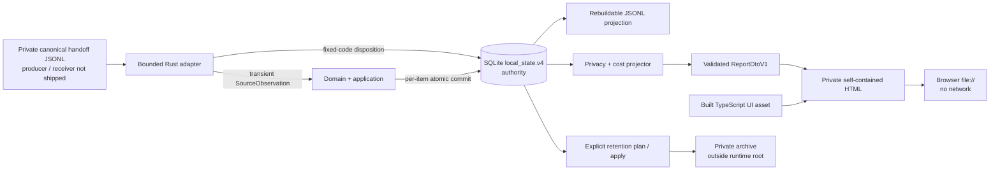
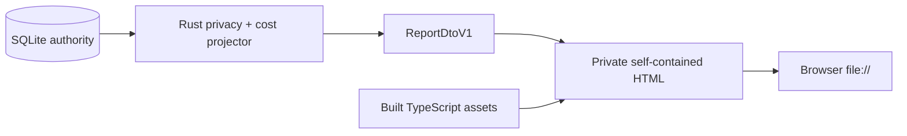

# Agent Observability

Coding agent의 token, latency, tool lifecycle, error, permission, compaction을 하나의
privacy-safe trace 모델로 정규화하고 로컬 SQLite와 self-contained HTML report로 확인하는
local-first observability project다.

> **Release status:** `v1.2.0` released with bounded local retention and private archive export.
> 현재 지원 범위는 macOS
> standalone private canonical handoff import다. Native receiver, foreground producer,
> team collector와 hosted UI는 아직 Future TODO다.

## 문서 바로가기

| 목적 | 문서 |
| --- | --- |
| 전체 수집·저장·report·retention 흐름 | [Collection Flow](docs/COLLECTION_FLOW.md) |
| 기술 스택, 책임 경계, SOLID/OOP/FP와 패턴 | [Architecture](docs/ARCHITECTURE.md) |
| 설치, runtime bounds, retention과 성능 검증 | [Local Runtime](docs/LOCAL_RUNTIME.md) |
| agent별 공식 surface와 지원 범위 | [Adapter Compatibility](docs/ADAPTER_COMPATIBILITY.md) |
| token 기반 예상 비용 계산 | [Cost Estimation](docs/COST_ESTIMATION.md) |
| static report UI 원칙 | [Design](DESIGN.md) |
| 버전별 범위와 release gate | [Roadmap](ROADMAP.md) |
| branch, PR, review와 merge 절차 | [Contributing](CONTRIBUTING.md) |
| Future TODO team profile | [Team Architecture](docs/TEAM_ARCHITECTURE.md) / [Team Contracts](docs/TEAM_CONTRACTS.md) |

## 현재 제공하는 것

- Codex, Claude Code, Cursor용 bounded canonical handoff adapter
- agent별 payload를 공통 `SourceObservation`과 trace/span 의미로 정규화
- observation 경로와 disposition 경로를 각각 cursor와 함께 원자적으로 기록하는 private SQLite authority
- strict `local_runtime.v2` 설정, singleton lock, storage admission과 load shedding
- whole-trace retention plan/apply, private JSONL archive와 bounded physical reclaim
- versioned rate table을 사용하는 token 기반 예상 비용
- Rust projector와 TypeScript UI를 조립한 network-free self-contained HTML report
- schema, privacy, crash recovery, browser, performance regression suite

현재 제공하지 않는 것:

- agent log/hook에서 canonical handoff를 만드는 foreground producer
- OTLP HTTP/gRPC receiver나 상시 실행 daemon
- 중앙 collector, login, raw email ingest, hosted team dashboard
- archive restore, correction, retraction, reinstatement와 aggregate rebuild
- macOS 및 capability manifest의 exact-version 범위를 넘어선 지원 보장

현재 검증된 adapter boundary:

| Agent | Verified version | Boundary | Known gap |
| --- | --- | --- | --- |
| Codex | `0.150.1` | macOS standalone private handoff | receiver와 producer 미포함 |
| Claude Code | `2.1.248` | macOS standalone private handoff | user interrupt signal 미확인 |
| Cursor | `3.17.21` | macOS standalone private handoff | specific shell/MCP/file hook은 diagnostic-only |

## 아키텍처



핵심 경계는 다음과 같다.

1. Adapter는 agent별 입력을 번역하며 durable storage나 UI를 직접 다루지 않는다.
2. Domain과 application은 agent payload, filesystem, SQLite, CLI와 UI에 의존하지 않는다.
3. SQLite가 권위 저장소이며 JSONL, snapshot과 HTML은 재생성 가능한 projection이다.
4. TypeScript UI는 원본 agent payload를 읽지 않고 Rust가 검증한 `ReportDtoV1`만 사용한다.
5. 현재 제품 경로에는 network 전송이 없다.

상세한 sequence와 retention/report 흐름은 [Collection Flow](docs/COLLECTION_FLOW.md)를 참고한다.

## 빠른 시작

> 이 흐름은 이미 생성된 private canonical handoff file이 있어야 실행할 수 있다. Agent hook/log에서
> handoff를 만드는 producer는 아직 이 repository에 포함되지 않는다.

필수 환경:

- Rust `1.97`
- Node.js `20+`
- macOS standalone environment

로컬 runtime을 초기화하고 검증한다.

```bash
cargo run -p agent-observability-cli -- init ~/.agent-observability
cargo run -p agent-observability-cli -- config-check ~/.agent-observability/config.json
cargo run -p agent-observability-cli -- runtime-check ~/.agent-observability
cargo run -p agent-observability-cli -- storage-check ~/.agent-observability
```

별도 producer가 만든 private canonical handoff를 agent별 adapter로 가져온다.

```bash
cargo run -p agent-observability-cli -- codex-ingest \
  ~/.agent-observability /path/to/private-codex-handoff.jsonl

cargo run -p agent-observability-cli -- claude-code-ingest \
  ~/.agent-observability /path/to/private-claude-handoff.jsonl

cargo run -p agent-observability-cli -- cursor-ingest \
  ~/.agent-observability /path/to/private-cursor-handoff.jsonl
```

정적 report를 생성한다.

```bash
cargo run -p agent-observability-cli -- report ~/.agent-observability

# Optional private rate table
cargo run -p agent-observability-cli -- report \
  ~/.agent-observability /path/to/private-rate-table.json
```

출력은 다음 경로에 mode `0600`으로 원자 기록된다.

```text
~/.agent-observability/logs/agent-observability-report.html
```

별도 server 없이 브라우저에서 `file://`로 열 수 있으며 외부 network request를 만들지 않는다.

## Retention

Retention은 ingest 중 암묵적으로 데이터를 지우지 않는다. 먼저 read-only plan을 만들고, 새 private
archive 경로를 지정해 명시적으로 적용한다.

```bash
cargo run -p agent-observability-cli -- retention-plan ~/.agent-observability

cargo run -p agent-observability-cli -- retention-apply \
  ~/.agent-observability PLAN_ID /path/to/private-retention-archive.jsonl
```

- cutoff와 같거나 이후인 관측이 하나라도 있는 trace는 전체가 유지된다.
- 만료 대상은 trace 전체 단위로 archive한 뒤 제거한다.
- bounded plan이 `truncated=true`이면 apply 전체를 거부한다.
- archive는 managed runtime 밖의 private directory에만 생성한다.
- source cursor와 bounded replay guard는 남아 오래된 재전송을 거부한다.

정확한 crash/retry와 reclaim 계약은 [Local Runtime](docs/LOCAL_RUNTIME.md#retention-and-private-archive)에
정리되어 있다.

## Report UI



현재 report는 repo/session/agent/model filter, saved view, bounded timeline, trace pagination,
token/cost/error KPI와 malformed DTO fail-closed state를 제공한다. 예상 비용은 실제 청구액이 아니며
rate table이 없거나 불완전하면 `unknown` 또는 `incomplete`로 표시한다.

## Privacy Invariants

- prompt, assistant output, tool output, cwd, command, path와 raw email은 Rust durable contract에 넣지 않는다.
- secret과 민감 field는 durable write 전에 allowlist와 redaction policy를 통과해야 한다.
- private runtime directory는 `0700`, managed files는 `0600`을 요구한다.
- symlink, broad permission, unknown schema field와 unsupported version은 fail closed한다.
- `SourceObservation`은 transient이며 SQLite, JSONL, HTML 또는 Future team envelope에 그대로 저장하지 않는다.
- 현재 standalone profile은 login, endpoint, outbox와 network client를 포함하지 않는다.

## Repository Map

| Path | Responsibility |
| --- | --- |
| `crates/domain` | opaque identifiers, lifecycle, topology와 token 의미 |
| `crates/contracts` | transient/durable/report contract와 capability manifest |
| `crates/adapter-*` | Codex, Claude Code, Cursor handoff translation |
| `crates/application` | pricing policy와 privacy-safe report projection |
| `crates/local-store` | SQLite authority, projection recovery와 retention |
| `crates/local-runtime` | config, lock, admission, resource policy |
| `crates/static-report` | validated DTO와 browser asset의 HTML assembly |
| `crates/cli` | one-shot product composition root |
| `ui/report` | strict TypeScript report UI source |
| `contracts` | shared closed JSON Schema |
| `xtask` | local performance protocol과 evidence validation |

## 검증

```bash
cargo fmt --all -- --check
cargo test --workspace --no-fail-fast
cargo clippy --workspace --all-targets -- -D warnings
cargo run -p agent-observability-cli -- contracts
npm test
cargo run -p xtask -- perf local --profile smoke --check
```

`smoke`는 개발용 비규범 검사다. Release 판정에는 별도의 uninterrupted release profile과
sanitized manifest review가 필요하다.

## Release와 기여

버전 하나는 하나의 release branch와 draft PR로 관리한다. CI, 독립 review와 release gate가 모두
통과한 뒤 문서를 `Released`로 바꾸고 merge하며, 결과 SHA를 확인한 다음 merged branch를 제거한다.
세부 절차는 [CONTRIBUTING.md](CONTRIBUTING.md), 버전별 상태는 [ROADMAP.md](ROADMAP.md)를 따른다.

현재 Future TODO team profile은 standalone core를 재사용하되 별도 collector composition root,
tenant isolation, RBAC, identity binding, deletion, quota, audit와 SLO/DR gate를 모두 통과하기 전에는
상용 기능으로 간주하지 않는다.
