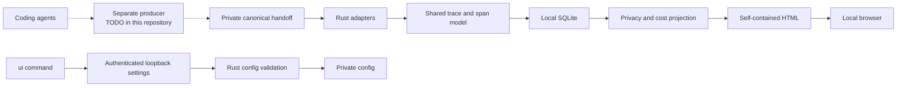
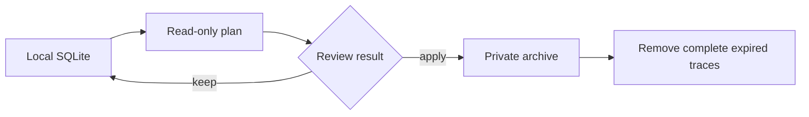

# Agent Observability

Codex, Claude Code, Cursor의 token 사용량, latency, tool 실행, error, permission을 하나의
로컬 대시보드에서 확인하는 privacy-first macOS CLI다. 서버나 계정 없이 동작하며 데이터와
HTML 대시보드는 사용자 Mac 밖으로 전송되지 않는다.

> **v1.6.0 범위:** one-command checksum-checked install, local setup, 내장 demo, 시각적 로컬 설정,
> 수동 private handoff import를 지원한다.
> agent 원본 로그를 자동으로 읽는 연결 기능은 아직 제공하지 않는다.

## 빠른 시작

### 1. 설치

Apple Silicon과 Intel Mac을 모두 지원하는 universal binary를 설치한다. 설치기는 release
checksum과 실행 파일 버전을 확인한 뒤 `~/.local/bin`에 원자적으로 설치하고, 현재 shell의
profile에 PATH 블록을 한 번만 등록한다.

```bash
(
  set -eu
  installer="$(mktemp)"
  trap 'rm -f "$installer"' 0
  curl -fsSL https://github.com/MCprotein/agent-observability/releases/latest/download/install.sh -o "$installer"
  sh "$installer"
)
```

새 terminal부터 별도 설정 없이 사용할 수 있다. 현재 terminal의 PATH에 설치 경로가 없으면
설치기가 출력하는 `. <선택된 profile>` 명령(기본 zsh는 `. ~/.zshrc`)을 한 번 실행한다. 설치 위치와 profile은 각각
`AGENT_OBSERVABILITY_INSTALL_DIR`, `AGENT_OBSERVABILITY_SHELL_PROFILE`로 변경할 수 있다.
checksum은 다운로드 무결성을 확인한다. 릴리스 자산의 repository/workflow provenance는 GitHub
artifact attestation으로 별도 게시된다.

### 2. 대시보드 체험

```bash
agent-observability demo
```

이 명령 하나가 content-free sample을 별도 `~/.agent-observability-demo` runtime에 넣고,
self-contained HTML 대시보드를 생성해 기본 브라우저에서 연다. 실제 데이터나 계정은 사용하지
않는다.

### 3. 설정 화면 열기

```bash
agent-observability ui
```

수집 허용, 확인·반영 주기, batch, heartbeat, 저장 한도, 보관 기간과 archive 한도를 한 화면에서
바꿀 수 있다. 설정할 때만 임의의 `127.0.0.1` port를 사용하며 browser tab의 session token,
Host와 Origin을 모두 확인한다. token은 같은 tab의 새로고침에서만 복구되며 세션 종료 시 삭제된다.
사용자가 1분 이상 화면을 조작하지 않으면 heartbeat를 멈추고,
연결이 10분 동안 끊기거나 설정 server가 시작된 후 1시간이 지나면 종료를 요청한다. 이 deadline은
로컬 executor와 filesystem이 응답하는 동안 적용된다. 불완전한 HTTP header는
5초 안에 닫고, 동시 연결은 64개로 제한하며, 종료 시 연결 정리는 최대 1초로 제한한다.

### 4. 실제 runtime 준비

```bash
agent-observability setup
```

기본 위치 `~/.agent-observability`에 private config와 SQLite 저장소를 만들고 대시보드를 연다.
처음에는 수집된 데이터가 없으므로 빈 화면이 정상이다. 브라우저를 열지 않는 자동화 환경에서는
`agent-observability setup --no-open`을 사용한다.

| 현재 경로 | 상태 | 의미 |
| --- | --- | --- |
| 로컬 runtime과 HTML 대시보드 | 지원 | 서버, login, web daemon 없이 `file://`로 실행 |
| 로컬 설정 UI | 지원 | `ui` 실행 중에만 인증된 loopback process 사용 |
| 내장 sample 체험 | 지원 | 외부 파일 없이 `demo` 한 명령으로 확인 |
| Canonical handoff import | 지원 | 검증된 private JSONL을 agent별 명령으로 가져옴 |
| Agent 자동 연결 | 준비 중 | 원본 hook/log 자동 감시와 producer는 아직 미포함 |
| Team collector | TODO | 현재 제품 경로에는 network 전송이 없음 |

## 무엇을 볼 수 있나

| 영역 | 대시보드에서 확인하는 내용 | 알아둘 점 |
| --- | --- | --- |
| Token | input, output, cached input, reasoning token | source가 제공하지 않은 값은 추정하지 않음 |
| Cost | model별 예상 비용과 합계 | local rate table이 없으면 `unknown`, 일부 단가만 있으면 `incomplete` |
| Performance | request latency, trace duration, 시간순 timeline | 입력에 timing이 있을 때만 표시 |
| Agent activity | LLM request, tool lifecycle, permission, compaction, error | agent별 verified source 범위가 다름 |
| 탐색 | repo, session, agent, model filter와 saved view | 대용량 report도 bounded pagination 적용 |
| Data lifecycle | 보관 기간, cleanup plan, private archive | 삭제는 자동이 아니라 plan 검토 후 명시적으로 실행 |

예상 비용은 실제 청구액이 아니다. 계산 방식과 rate table 형식은
[Cost Estimation](docs/COST_ESTIMATION.md)에 정리되어 있다.

## 실제 데이터 가져오기

현재 release는 agent 원본 파일을 직접 읽지 않는다. 별도 producer가 만든 private canonical
handoff를 아래 명령으로 가져온다. 이 제한은 설정 실수로 원문 prompt, output, path가 durable
storage로 넘어가는 것을 막기 위한 현재 release 경계다.

```bash
agent-observability codex-ingest ~/.agent-observability /path/to/codex-handoff.jsonl
agent-observability claude-code-ingest ~/.agent-observability /path/to/claude-handoff.jsonl
agent-observability cursor-ingest ~/.agent-observability /path/to/cursor-handoff.jsonl
agent-observability dashboard
```

handoff 생성 규격과 허용 source는 [Adapter Compatibility](docs/ADAPTER_COMPATIBILITY.md)를
따른다. 자동 연결이 추가되기 전까지 이 단계는 advanced/manual workflow다.

## 설정 변경

설정은 설치 후 언제든 browser에서 변경할 수 있다. 값의 허용 범위와 서로 다른 주기를
시각적으로 비교하고 저장하면 Rust가 전체 config를 다시 검증해 원자적으로 교체한다.

```bash
agent-observability ui
```

headless 환경이나 자동화에서는 같은 계약을 CLI로 사용할 수 있다.

```bash
# 현재 설정
agent-observability config show

# 데이터를 90일 보관
agent-observability config set retention-days 90

# 로컬 저장 공간을 2 GiB로 제한
agent-observability config set storage-bytes 2147483648
```

별도 runtime을 사용한다면 `config set <root> <option> <value>` 형식으로 root를 지정한다.
지원 option, 기본값, 허용 범위는 [Configuration](docs/CONFIGURATION.md)에 있다.

## Agent 지원 범위

`Verified`는 해당 버전의 canonical handoff를 안전하게 정규화한다는 뜻이다. 자동 설치나 원본
로그 자동 수집을 의미하지 않는다.

| Agent | Verified version | 현재 지원 | 알려진 제한 |
| --- | --- | --- | --- |
| Codex | `0.150.1` | OTel/notify canonical handoff import | 자동 producer와 receiver 미포함 |
| Claude Code | `2.1.248` | OTel/hook canonical handoff import | user interrupt signal 미확인 |
| Cursor | `3.17.21` | generic tool canonical handoff import | 일부 shell/MCP/file event는 diagnostic-only |

버전별 source와 fallback 정책은 [Adapter Compatibility](docs/ADAPTER_COMPATIBILITY.md)가 정본이다.

## 동작 구조



- 점선은 현재 release가 제공하지 않는 agent별 producer 경계다.
- 실선은 `v1.6.0` CLI가 구현하고 검증하는 local-only 경로다.
- agent별 차이는 adapter에서 끝나고 이후 저장·비용·UI contract는 하나다.
- SQLite가 로컬 권위 저장소이며 JSONL archive와 HTML은 다시 만들 수 있는 projection이다.
- TypeScript UI는 원본 agent payload가 아니라 Rust가 검증한 report DTO만 받는다.
- report는 endpoint 없이 `file://`로 열리고, 설정 endpoint는 `ui` process 수명 동안 loopback에만 존재한다.
- 설정 화면은 별도 UI instance lock만 유지한다. 저장할 때만 runtime lock을 짧게 획득하므로 열린
  화면이 ingest, report, CLI 설정 변경을 계속 막지 않는다. 지원되는 다른 설정 명령과 revision이
  충돌하면 최신 값 위에 화면의 변경만 다시 적용하고 재확인을 요구한다. `config.json` 직접 편집은
  지원 인터페이스가 아니다.
- standalone 경로에는 login, collector, 외부 network request가 없다.

상세 책임 경계는 [Architecture](docs/ARCHITECTURE.md), 전체 처리 순서는
[Collection Flow](docs/COLLECTION_FLOW.md)에 있다.

## Retention

보관 기간은 언제든 변경할 수 있지만 실제 정리는 자동 실행되지 않는다.



```bash
agent-observability config set retention-days 90
agent-observability retention-plan ~/.agent-observability
agent-observability retention-apply \
  ~/.agent-observability PLAN_ID /private/path/expired-traces.jsonl
```

| 원칙 | 동작 |
| --- | --- |
| Trace 단위 | 한 trace를 중간에서 나누어 삭제하지 않음 |
| Plan 우선 | `retention-plan`은 저장소를 변경하지 않음 |
| Archive 우선 | apply가 private archive를 확정한 뒤 만료 데이터를 제거 |
| Fail closed | plan이 잘렸거나 저장소가 바뀌면 apply를 거부 |

Crash recovery와 replay 규칙은 [Local Runtime](docs/LOCAL_RUNTIME.md#retention-and-private-archive)에
있다.

## Privacy 기본값

| 보호 대상 | 기본 동작 |
| --- | --- |
| Prompt, response, tool output | durable storage와 report에 저장하지 않음 |
| Command, cwd, path, raw email | allowlist contract 밖에서는 저장하지 않음 |
| Runtime directory | `0700`만 허용 |
| Config, archive, report | `0600`으로 기록 |
| Unknown field와 schema | 추측하지 않고 거부 |
| External network | standalone outbound 경로 없음; 설정 화면은 실행 중 인증된 loopback만 사용 |

## 다른 설치 방법

<details>
<summary>GitHub Packages</summary>

GitHub Packages는 `read:packages` 권한이 있는 personal access token(classic)이 필요하다.

```bash
npm login \
  --scope=@mcprotein \
  --auth-type=legacy \
  --registry=https://npm.pkg.github.com
npm install --global @mcprotein/agent-observability \
  --registry=https://npm.pkg.github.com
```

Package는 JavaScript wrapper가 아니라 macOS universal Rust binary를 직접 설치한다.
</details>

<details>
<summary>소스에서 실행</summary>

Rust `1.97`과 Node.js `20+`가 필요하다.

```bash
cargo run -p agent-observability-cli -- demo
```
</details>

## 명령 요약

| Command | 용도 |
| --- | --- |
| `demo [root] [--no-open]` | 격리된 sample 대시보드 생성 |
| `setup [root] [--no-open]` | 실제 private runtime 초기화 |
| `dashboard [root] [--no-open]` | 최신 report를 만들고 필요하면 브라우저에서 열기 |
| `ui [root] [--no-open]` | 임시 local-only 설정 화면 열기 |
| `config show [root]` | 현재 설정 확인 |
| `config set [root] <option> <value>` | 검증 후 설정 원자 교체 |
| `<agent>-ingest <root> <handoff>` | private canonical handoff import |
| `retention-plan <root>` | read-only cleanup 계획 |
| `retention-apply <root> <plan-id> <archive>` | archive 후 만료 trace 정리 |

전체 명령은 `agent-observability help`에서 확인한다.

## 문서

| 찾는 내용 | 문서 |
| --- | --- |
| 설정 option과 범위 | [Configuration](docs/CONFIGURATION.md) |
| agent별 입력 지원 | [Adapter Compatibility](docs/ADAPTER_COMPATIBILITY.md) |
| 수집부터 report까지 | [Collection Flow](docs/COLLECTION_FLOW.md) |
| 기술 스택과 책임 경계 | [Architecture](docs/ARCHITECTURE.md) |
| 성능, storage, retention | [Local Runtime](docs/LOCAL_RUNTIME.md) |
| 비용 계산 | [Cost Estimation](docs/COST_ESTIMATION.md) |
| 버전 계획 | [Roadmap](ROADMAP.md) |
| 기여와 release 절차 | [Contributing](CONTRIBUTING.md) |

## 개발과 라이선스

```bash
cargo fmt --all -- --check
cargo test --workspace --no-fail-fast
cargo clippy --workspace --all-targets -- -D warnings
npm test
```

Apache License 2.0. 자세한 내용은 [LICENSE](LICENSE)를 확인한다.
