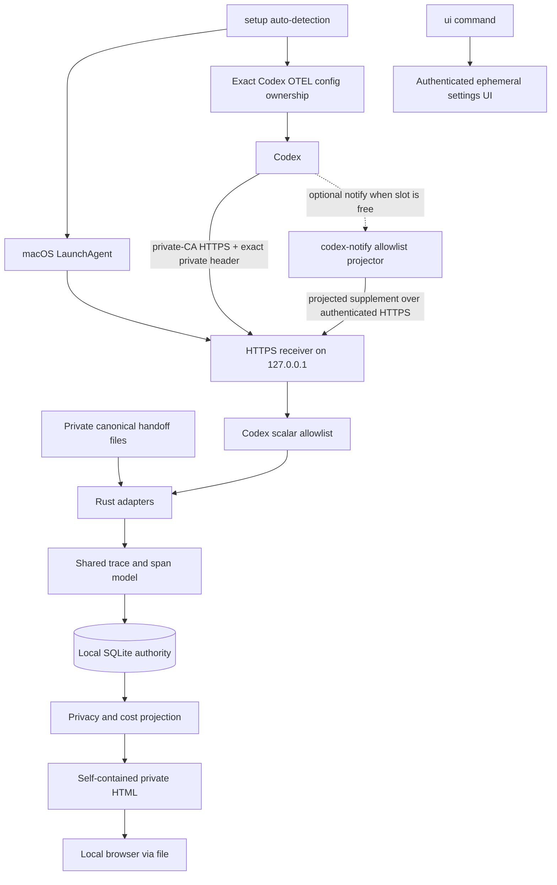
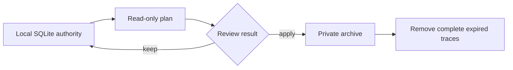

# Agent Observability

Codex, Claude Code, Cursor의 token 사용량, latency, tool 실행, error, permission을 하나의
로컬 대시보드에서 확인하는 privacy-first macOS CLI다. 외부 서버나 계정 없이 동작하며 데이터와
HTML 대시보드는 사용자 Mac 밖으로 전송되지 않는다.

> **v1.8.3 준비 중.** 기존 Codex, Claude Code, Cursor private handoff import는 daemon이나
> network 없이 계속 동작한다. v1.8.2에서 추가된 선택적 Codex WebSocket 자동 수집은 private CA HTTPS와
> exact private random request header로 보호한 `127.0.0.1` OTLP/HTTP JSON receiver와 macOS
> LaunchAgent를 사용한다. 기존 Codex 앱의 `notify` 명령이 있으면 그대로 보존하고, 비어 있을 때만
> content-free notify supplement를 설치한다. correlation identity가 있는 HTTP request와 WebSocket
> request-start를 각각 해당 token completion과 연결하며, correlation-less global API event는
> diagnostic-only로 둔다. 이 transport는 mTLS가 아니다.
> setup은 기존 agentobs 소유 OTEL 값이 그대로인 경우 이후 추가된 비소유 Codex 설정을 보존하면서
> ownership snapshot을 자동 재조정한다. 소유 값이 바뀌면 계속 fail-closed 한다.
> Claude Code/Cursor 자동 수집과 commercial team profile은 아직 TODO다.

> **v1.7 이하에서 업그레이드할 때:** 인자 없는 `agentobs setup`은 로컬 Codex를 감지한 경우에만
> Codex 설정을 연결하고 persistent local LaunchAgent를 시작한다. 기존처럼 수동 import runtime과 dashboard만 준비하는
> script는 `agentobs setup ~/.agent-observability --no-open`처럼 root를 명시한다. 자동 연결은 이후
> 설정 UI 또는 고급 lifecycle 명령으로 언제든 추가할 수 있다.

아래 automatic 명령과 설치 경로는 게시된 최신 안정판 v1.8.2 기준이다.

## 빠른 시작

### 1. 설치

게시된 installer는 Apple Silicon과 Intel Mac을 모두 지원하는 universal binary를 설치한다. 설치기는
release checksum과 실행 파일 버전을 확인한 뒤 `~/.local/bin`에 원자적으로 설치하고, 현재 shell의
profile에 PATH 블록을 한 번만 등록한다.

검증된 v1.8.2 installer를 사용한다.

```bash
(
  set -eu
  installer="$(mktemp)"
  trap 'rm -f "$installer"' 0
  curl -fsSL https://github.com/MCprotein/agent-observability/releases/download/v1.8.2/install.sh -o "$installer"
  sh "$installer"
)
```

새 terminal부터 별도 설정 없이 사용할 수 있다. 현재 terminal의 PATH에 설치 경로가 없으면
설치기가 출력하는 `. <선택된 profile>` 명령(기본 zsh는 `. ~/.zshrc`)을 한 번 실행한다. 설치 위치와 profile은 각각
`AGENT_OBSERVABILITY_INSTALL_DIR`, `AGENT_OBSERVABILITY_SHELL_PROFILE`로 변경할 수 있다.
checksum은 다운로드 무결성을 확인한다. 릴리스 자산의 repository/workflow provenance는 GitHub
artifact attestation으로 별도 게시된다.

### 2. 대시보드 체험

```bash
agentobs demo
```

이 명령 하나가 content-free sample을 별도 `~/.agent-observability-demo` runtime에 넣고,
self-contained HTML 대시보드를 생성해 기본 브라우저에서 연다. 실제 데이터나 계정은 사용하지
않는다.

### 3. 설정 화면 열기

```bash
agentobs ui
```

Codex automatic 연결/해제와 상태 확인, report 열기, 수집 허용, 확인·반영 주기, batch, heartbeat,
저장 한도, 보관 기간과 archive 한도를 한 화면에서 관리한다. UI 자체는 실행 중에만 임의의
`127.0.0.1` port를 사용하며 browser tab의 session token,
Host와 Origin을 모두 확인한다. token은 같은 tab의 새로고침에서만 복구되며 세션 종료 시 삭제된다.
사용자가 1분 이상 화면을 조작하지 않으면 heartbeat를 멈추고,
연결이 10분 동안 끊기거나 설정 server가 시작된 후 1시간이 지나면 종료를 요청한다. 이 deadline은
로컬 executor와 filesystem이 응답하는 동안 적용된다. 불완전한 HTTP header는
5초 안에 닫고, 동시 연결은 64개로 제한하며, 종료 시 연결 정리는 최대 1초로 제한한다.

### 4. Codex 자동 수집 시작

```bash
agentobs setup
```

이 한 명령은 로컬 Codex 환경을 감지해 기본 위치 `~/.agent-observability`에 private runtime과 embedded
SQLite transactional store를 만들고, 초기 대시보드를 생성해 연 다음 필요한 OTEL 설정과 local collector
LaunchAgent를 연결한다. Codex가 감지되지 않으면 runtime과 dashboard만 준비하고 `codex=not_detected`를
출력하며 Codex 디렉터리, 설정, collector service는 만들지 않는다. 이미 Codex 앱이나 다른 로컬 도구가
`notify`를 사용 중이면 그 명령은 건드리지 않고 `notify=external_preserved`로 알린다. 대시보드 생성이나
열기에 실패하면 연결을 시작하지 않으며, 반대로 연결이 실패하면 이미 연 로컬 대시보드는 남을 수 있다. 브라우저를 열지
않는 환경에서는 `agentobs setup --no-open`을 사용한다. 처음에는 수집된 데이터가 없으므로 빈
화면이 정상이다.

대시보드는 다음 private file에 생성된다.

```text
~/.agent-observability/logs/agent-observability-report.html
```

평소에는 `setup`만 사용하면 된다. 아래 명령은 문제 진단이나 연결 해제처럼 lifecycle을 직접 관리할 때만 사용한다.

```bash
agentobs connect codex
agentobs status codex
agentobs disconnect codex
```

`disconnect`는 collector service를 연결 전의 정확한 plist와 loaded 상태로 되돌린 뒤 Codex 설정을
ownership snapshot의 prior bytes와 permission으로 복원한다. 명시적 setup/connect가 안전하게 재조정한
비소유 변경은 이 prior state에 포함되어 보존된다. connect가 새로 만든 service는 종료·제거하고, config는
연결 뒤 비소유 변경이 없을 때만 제거한다. agentobs가 소유하지 않은 기존 `notify`는 연결 중에도 보존된다. 재조정되지 않은 설정 변경이 commit 전
exact-state 검사에서 관측되면 편집을 덮어쓰지 않고 중단한다. agentobs lifecycle writer끼리는 private
lock으로 직렬화한다. 단, 같은 파일의 열린 descriptor에 lock을 무시하고 동시에 쓰는 임의 프로세스까지
portable하게 배제하는 filesystem CAS는 아니므로 그런 비협조적 write와의 최종 경쟁은 보장하지 않는다. 이미 수집된
local data는 유지된다.

macOS 시스템 설정의 **로그인 항목 및 확장 프로그램 > 앱 백그라운드 활동**에
`agent-observability`가 보일 수 있다. 별도 GUI 앱이 설치된 것이 아니라 자동 수집용 CLI collector를
launchd가 로그인 후 다시 실행할 수 있도록 등록한 표시다. `agentobs disconnect codex`가 이 등록을
연결 전 상태로 복원한다.

사용자 문서의 권장 명령은 `agentobs`다. 모니터링 화면은 `agentobs dashboard`, 설정 화면은
`agentobs ui`로 연다. 배포 파일명인 `agent-observability`도 호환 명령으로 계속 제공한다.

| 현재 경로 | 상태 | 의미 |
| --- | --- | --- |
| 로컬 runtime과 HTML 대시보드 | 지원 | 서버, login, web daemon 없이 `file://`로 실행 |
| 로컬 설정 UI | 지원 | UI server는 `ui` 실행 중에만 존재하며 Codex 연결과 runtime config 관리 제공 |
| 내장 sample 체험 | 지원 | 외부 파일 없이 `demo` 한 명령으로 확인 |
| Canonical handoff 수동 import | 지원 | 세 agent 모두 daemon과 network 없이 private JSONL import 가능 |
| Codex 자동 연결 | 실험적 (v1.8.2 출시) | `setup`이 macOS Codex를 자동 연결하며 기존 notify를 보존하고 loopback OTLP/HTTP JSON을 사용 |
| Claude Code/Cursor 자동 연결 | TODO | 현재 자동 receiver/config 연결은 Codex만 지원 |
| Commercial team profile | TODO | G0-G4 승인과 evidence 전에는 완료로 간주하지 않음 |

## 무엇을 볼 수 있나

| 영역 | 대시보드에서 확인하는 내용 | 알아둘 점 |
| --- | --- | --- |
| Token | input, output, cached input, reasoning token | source가 제공하지 않은 값은 추정하지 않음 |
| Cost | model별 예상 비용과 합계 | local rate table이 없으면 `unknown`, 일부 단가만 있으면 `incomplete` |
| Performance | request latency, trace duration, 시간순 timeline | 입력에 timing이 있을 때만 표시 |
| Agent activity | LLM request, tool lifecycle, permission, compaction, error | agent별 verified source 범위가 다름 |
| 탐색 | repo, session, agent, model filter와 saved view | 대용량 report도 bounded pagination 적용 |
| Data lifecycle | 보관 기간, cleanup plan, private archive | 삭제는 자동이 아니라 plan 검토 후 명시적으로 실행 |

예상 비용은 실제 청구액이 아니다. 계산 방식과 rate table 형식은
[Cost Estimation](docs/COST_ESTIMATION.md)에 정리되어 있다.

## 실제 데이터 가져오기

### Codex 자동 수집

`agentobs setup`이 로컬 Codex를 감지해 `$CODEX_HOME/config.toml`을 연결한다.
`CODEX_HOME`이 없으면 `~/.codex/config.toml`을 사용한다. Codex telemetry는 private CA로 server를
검증하는 HTTPS와 exact `x-agent-observability-token` request header를 사용해 `127.0.0.1`
receiver에 들어온다. Header 값은 runtime이 생성하는 private random 256-bit value다. Codex
exporter에 client certificate나 client private-key field를 넣지 않으며, 이 transport는 mTLS가 아니다.
기존 `notify`가 없을 때만 `agent-turn-complete` supplement를 설치하며, raw payload를 전송 전에 bounded
allowlist로 축약해 turn 완료만 보완한다. 기존 notify가 있으면 OTEL이 기본 수집 경로가 된다. 어느 경로도
외부 network를 사용하지 않는다.

Raw notify payload는 foreground helper의 bounded parsing 동안에만 process memory에 존재하며 receiver나
socket에는 들어가지 않는다. Raw OTLP/tool field는 receiver의 bounded parsing 동안 일시적으로 존재할
수 있다. Adapter boundary를 통과하는 값은 명시적으로 허용된 scalar뿐이다. Prompt, response, tool
arguments/output, command, cwd, path, account identity와 unknown field는 persist, log, projection 또는
export 전에 버려진다.

### 수동 import

수동 import 경로는 그대로 지원한다. 별도 producer가 만든 private canonical handoff를 아래
명령으로 가져오며 resident collector, LaunchAgent, login 또는 network가 필요하지 않다.

```bash
agentobs codex-ingest ~/.agent-observability /path/to/codex-handoff.jsonl
agentobs claude-code-ingest ~/.agent-observability /path/to/claude-handoff.jsonl
agentobs cursor-ingest ~/.agent-observability /path/to/cursor-handoff.jsonl
agentobs dashboard
```

handoff 생성 규격과 허용 source는 [Adapter Compatibility](docs/ADAPTER_COMPATIBILITY.md)를
따른다. Claude Code와 Cursor의 현재 실제-data 경로는 이 수동 import다.

## 설정 변경

설정은 설치 후 언제든 browser에서 변경할 수 있다. 값의 허용 범위와 서로 다른 주기를
시각적으로 비교하고 저장하면 Rust가 전체 config를 다시 검증해 원자적으로 교체한다.

```bash
agentobs ui
```

headless 환경이나 자동화에서는 같은 계약을 CLI로 사용할 수 있다.

```bash
# 현재 설정
agentobs config show

# 데이터를 90일 보관
agentobs config set retention-days 90

# 로컬 저장 공간을 2 GiB로 제한
agentobs config set storage-bytes 2147483648
```

별도 runtime을 사용한다면 `config set <root> <option> <value>` 형식으로 root를 지정한다.
지원 option, 기본값, 허용 범위는 [Configuration](docs/CONFIGURATION.md)에 있다.

## Agent 지원 범위

`Verified version`은 capability manifest가 해당 버전의 canonical source 의미를 검증한다는 뜻이다.
Codex `0.151.0` strict config load는 config parsing만 검증하며 exporter construction이나 native
telemetry delivery를 검증하지 않는다. macOS에서 client identity field가 있는 이전 config는
exporter construction에 실패했다. 보정된 transport에서 실제 Codex process가 content-free loopback
Responses fixture를 호출해 native telemetry를 collector와 durable report까지 전달하는 local e2e와
최종 source `2d2dcc004fbdf2bc7aaa487ea408ac9100456e1e`의 exact-revision 5-run evidence가 통과해 automatic
capability entry는 v1.8.1 기준 `supported`다. v1.8.1 tag, Package와 public Release도 게시 검증을 마쳤다.

Codex `0.152.1`에서 관측된 correlation-less global HTTP API event는 diagnostic-only로 유지한다.
WebSocket 경로는
`codex.websocket_request`를 시작 이벤트로 삼고 token usage가 있는 `response.completed`와 private
correlation ID로 연결한다. v1.8.2의 exact-revision five-run evidence와 실제 Codex e2e가 통과했으며,
게시된 최신 안정판은 v1.8.2다.

| Agent | Pinned / verified version | 현재 지원 | 알려진 제한 |
| --- | --- | --- | --- |
| Codex | 수동 verified `0.150.1`; 자동 release-verified `0.152.1` | 수동 handoff + 실험적 자동 local OTLP/HTTP JSON/notify | 자동 경로는 macOS only; `0.153.0`은 미검증 |
| Claude Code | `2.1.248` | OTel/hook canonical handoff 수동 import | 자동 연결 TODO, user interrupt signal 미확인 |
| Cursor | `3.17.21` | generic tool canonical handoff 수동 import | 자동 연결 TODO, 일부 shell/MCP/file event는 diagnostic-only |

버전별 source와 fallback 정책은 [Adapter Compatibility](docs/ADAPTER_COMPATIBILITY.md)가 정본이다.

## 동작 구조



- Codex automatic path와 manual handoff path는 같은 adapter, domain, store와 report contract로 합류한다.
- Claude Code와 Cursor automatic producer/receiver는 아직 이 그림의 구현 범위가 아니다.
- agent별 차이는 adapter에서 끝나고 이후 저장·비용·UI contract는 하나다.
- Embedded SQLite store가 로컬 권위 저장소이며 JSONL archive와 HTML은 다시 만들 수 있는 projection이다.
- TypeScript UI는 원본 agent payload가 아니라 Rust가 검증한 report DTO만 받는다.
- report는 endpoint 없이 `file://`로 열린다. 자동 collector와 설정 UI는 서로 다른 인증된 loopback
  endpoint이며 외부 interface에 bind하지 않는다.
- 설정 화면은 별도 UI instance lock만 유지한다. 저장할 때만 runtime lock을 짧게 획득하므로 열린
  화면이 ingest, report, CLI 설정 변경을 계속 막지 않는다. 지원되는 다른 설정 명령과 revision이
  충돌하면 최신 값 위에 화면의 변경만 다시 적용하고 재확인을 요구한다. `config.json` 직접 편집은
  지원 인터페이스가 아니다.
- 수동 standalone 경로에는 login, daemon, collector, network request가 없다. 선택한 Codex automatic
  경로만 local LaunchAgent와 `127.0.0.1` receiver를 추가하며 외부 network request는 만들지 않는다.

상세 책임 경계는 [Architecture](docs/ARCHITECTURE.md), 전체 처리 순서는
[Collection Flow](docs/COLLECTION_FLOW.md)에 있다.

## Retention

보관 기간은 언제든 변경할 수 있지만 실제 정리는 자동 실행되지 않는다.



```bash
agentobs config set retention-days 90
agentobs retention-plan ~/.agent-observability
agentobs retention-apply \
  ~/.agent-observability PLAN_ID /private/path/expired-traces.jsonl
```

| 원칙 | 동작 |
| --- | --- |
| Trace 단위 | 한 trace를 중간에서 나누어 삭제하지 않음 |
| Plan 우선 | `retention-plan`은 저장소를 변경하지 않음 |
| Archive 우선 | apply가 private archive를 확정한 뒤 만료 데이터를 제거 |
| Fail closed | plan이 잘렸거나 저장소가 바뀌면 apply를 거부 |

Crash recovery와 replay 규칙은 [Local Runtime](docs/LOCAL_RUNTIME.md#retention-and-private-archive)에
있다.

## Privacy 기본값

| 보호 대상 | 기본 동작 |
| --- | --- |
| Prompt, response, tool output | durable storage와 report에 저장하지 않음 |
| Command, cwd, path, raw email | allowlist contract 밖에서는 저장하지 않음 |
| Raw notify | foreground helper에서 allowlist projection한 뒤에만 private-CA HTTPS와 exact private header로 전달 |
| Raw OTLP/tool field | bounded parse 동안 memory에만 일시 존재할 수 있고 persist/log/project/export하지 않음 |
| Runtime directory | `0700`만 허용 |
| Config, archive, report | `0600`으로 기록 |
| Unknown field와 schema | 추측하지 않고 거부 |
| External network | standalone outbound 경로 없음; 자동 collector는 인증된 HTTPS loopback, 설정 화면은 별도 인증 loopback만 사용 |

Private CA server certificate는 정상 client가 신뢰하지 않는 loopback listener로 payload를
보내지 않게 하고, exact private random header는 credential이 없는 request를 receiver가 거부하게
한다. 같은 OS 사용자 권한으로 `0600` header secret이나 server private key를 읽을 수 있는
악성 process는 이 경계로 격리할 수 없으며, 그런 위협에는 별도 계정이나 OS sandbox가 필요하다.

## 다른 설치 방법

<details>
<summary>GitHub Packages</summary>

GitHub Packages 설치에는 `read:packages` 권한이 있는
personal access token(classic)이 필요하다.

```bash
npm login \
  --scope=@mcprotein \
  --auth-type=legacy \
  --registry=https://npm.pkg.github.com
npm install --global @mcprotein/agent-observability@1.8.2 \
  --registry=https://npm.pkg.github.com
```

Package는 JavaScript wrapper가 아니라 macOS universal Rust binary를 직접 설치한다.
</details>

<details>
<summary>소스에서 실행</summary>

Rust `1.97`과 Node.js `20+`가 필요하다.

```bash
cargo run -p agent-observability-cli -- demo
```
</details>

## 명령 요약

| Command | 용도 |
| --- | --- |
| `demo [root] [--no-open]` | 격리된 sample 대시보드 생성 |
| `setup [--no-open]` | 기본 runtime 초기화, Codex 자동 연결, 대시보드 생성 |
| `setup <root> [--no-open]` | 별도 runtime을 수동-import mode로 초기화 |
| `connect codex [root]` | Codex 설정과 local collector 연결 |
| `status codex [root]` | Codex config ownership과 collector health 확인 |
| `disconnect codex [root]` | Codex 설정 복원, collector 중지, local data 유지 |
| `dashboard [root] [--no-open]` | 최신 report를 만들고 필요하면 브라우저에서 열기 |
| `ui [root] [--no-open]` | 임시 local-only 설정 화면 열기 |
| `config show [root]` | 현재 설정 확인 |
| `config set [root] <option> <value>` | 검증 후 설정 원자 교체 |
| `<agent>-ingest <root> <handoff>` | private canonical handoff import |
| `retention-plan <root>` | read-only cleanup 계획 |
| `retention-apply <root> <plan-id> <archive>` | archive 후 만료 trace 정리 |

전체 명령은 `agentobs help`에서 확인한다. `agent-observability help`도 동일하게 동작한다.

## 문서

| 찾는 내용 | 문서 |
| --- | --- |
| 설정 option과 범위 | [Configuration](docs/CONFIGURATION.md) |
| agent별 입력 지원 | [Adapter Compatibility](docs/ADAPTER_COMPATIBILITY.md) |
| 수집부터 report까지 | [Collection Flow](docs/COLLECTION_FLOW.md) |
| 기술 스택과 책임 경계 | [Architecture](docs/ARCHITECTURE.md) |
| 성능, storage, retention | [Local Runtime](docs/LOCAL_RUNTIME.md) |
| 비용 계산 | [Cost Estimation](docs/COST_ESTIMATION.md) |
| 버전 계획 | [Roadmap](ROADMAP.md) |
| 기여와 release 절차 | [Contributing](CONTRIBUTING.md) |

## 개발과 라이선스

```bash
cargo fmt --all -- --check
cargo test --workspace --no-fail-fast
cargo clippy --workspace --all-targets -- -D warnings
npm test
```

Apache License 2.0. 자세한 내용은 [LICENSE](LICENSE)를 확인한다.
