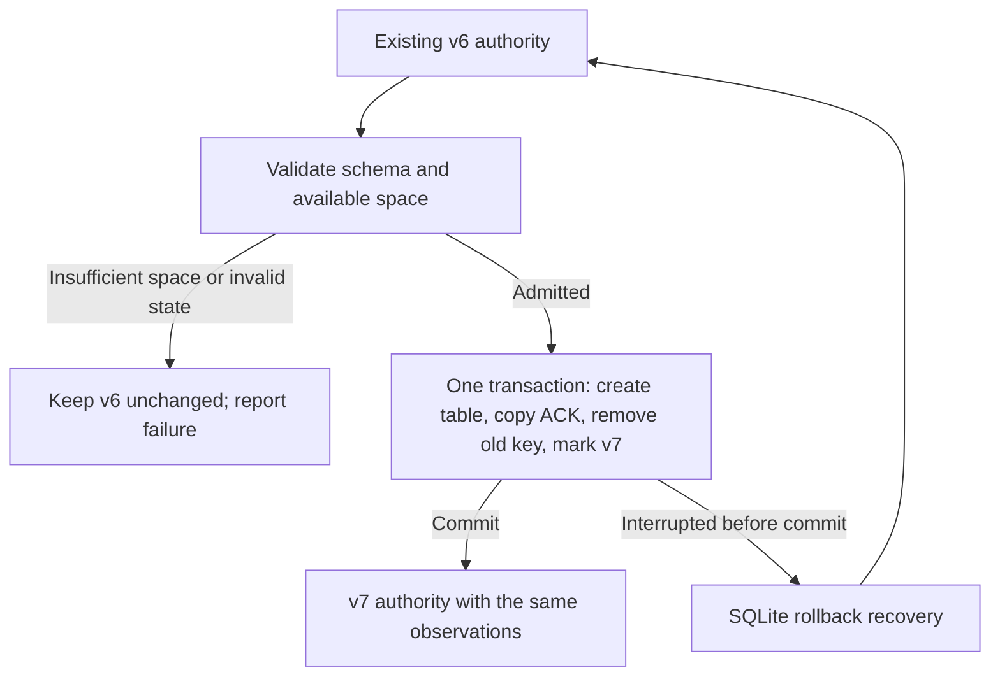

# Report acknowledgement storage

Status: approved v1.11 development scope; not a released or installed migration.

The report's completion marker must fit its reserved disk budget even when the main metadata
table contains large correlation state. `local_state.v7` therefore stores the acknowledged
generation in a separate singleton table. The authoritative report generation and visibility
epoch remain unchanged; no observation, cursor, trace or raw detail is removed by this migration.

## State and migration

| Item | Contract |
| --- | --- |
| New acknowledgement | `report_acknowledgement`, one row with `id=1`, eight-byte big-endian unsigned generation BLOB |
| Former acknowledgement | v6 metadata key `report_acknowledged_generation`; removed in the migration transaction |
| Compatibility | v4–v6 migrate to v7 in one admitted transaction; v1–v3 retain their historical rewrite path first |
| Interrupted migration | Before commit, SQLite recovery restores v6; after commit, the store reopens as v7 |
| Older program | An exact v6 schema reader rejects v7. Do not manually downgrade the schema marker |
| Existing report views | Generation/visibility and source identity are preserved; normal sidecar replacement/retirement remains in force |



Preflight runs before persistent connection-setting changes. v4–v6 require initial headroom
`N × (P + 8) + 6 MiB` for journal preparation, where `N` is the existing page count and `P` the
page size. This is an initial gate, not a promise that every database will pass final admission.
The whole v4/v5/v6→v7 chain runs under one immediate transaction with cache spilling disabled,
memory-only temporary sorting and a growth ceiling of `min(H−6 MiB,64 MiB)/P` pages, where `H`
is admitted incremental headroom. This keeps the byte ceiling consistent across page sizes.
Settings are restored afterward.
The v6 table manifest is validated before ACK DDL; invalid or partial state is rejected.

Immediately before commit, the coordinator measures journal length `L`, physical journal allocation
`A`, initial freelist pages `F` and actual growth `G`. For `S=65536` and `C=ceil(S/P)`:

```text
D = min(N, ceil(L/(P+8)) + C)
M = (min(N, D+F) + G) × P
J = L + S + C × (P+8)
required peak = max(J,A) + M + 6 MiB
```

That peak must fit the original incremental headroom. Remaining filesystem space must also cover
`max(0,J-A) + M + 6 MiB`. This counts sparse-page materialization, freelist reuse, growth and
commit-time header/co-sector writes without reserving a second full authority copy. Failure rolls
back to the original v4/v5/v6 state. Arithmetic overflow fails closed. v1–v3 retain the conservative
rewrite allowance `N × (2P+8) + 2 MiB` and are not covered by this staged proof.

The coordinator rejects WAL/FULL-auto-vacuum, attached/temp schemas and atomic-write compilation
options before mutation. Existing journals are privacy-checked before SQLite opens the authority;
header and allocation checks use no-follow, descriptor-validated files. It rechecks transaction modes.
SQLite may reuse a private empty or
zero-header inactive journal left by a process exit; the coordinator never deletes it manually.
The memory-only sorter avoids unaccounted temporary files, but memory performance remains a
separate verification gate; the page ceiling is not a whole-process RSS limit.

Before migration, interrupted report reservations can recover sidecars against validated v6/v7
authority without migrating it. Only successful guarded cleanup releases that reservation. Normal
SQLite hot-journal recovery may run when opening the existing authority; JSONL repair is not required.

## Bounded steady-state write

An acknowledgement is accepted only while `BEGIN IMMEDIATE` sees exactly the rendered generation.
The update replaces the existing eight-byte value; it never inserts a missing row or updates the
variable-size metadata table. Unknown layouts fail closed.

Required checks: exact table DDL, no additional index/trigger on that table, no temporary schema
objects or attached databases, exactly one row, and one `dbstat` leaf page. The transaction verifies
`journal_mode=DELETE` and `auto_vacuum=INCREMENTAL`; its connection requires `synchronous=FULL`,
`locking_mode=NORMAL`, autocommit entry and disabled cache spilling. Mode and row failures leave
the report pending rather than pretending acknowledgement succeeded.

For the bundled SQLite 3.53.2 implementation, only the singleton leaf and database-header page are
logically dirtied. Conservatively include all pages sharing their sectors. With legal page size
`P`, maximum effective sector `S=65536`, and `k=ceil(S/P)`:

| Allocation | Maximum incremental bytes |
| --- | ---: |
| Rollback journal: `S + 2k(P + 8)`, rounded to 4096 | 200,704 |
| Materializing sparse co-sector database pages: `2kP` | 131,072 |
| Directory allocation allowance | 4,096 |
| Total acknowledgement allowance | **335,872** |
| Catalog publication allowance, separately reserved | 65,536 |
| Collector finalization reservation | **401,408** |

These are conservative bounds under the enforced layout and the runtime allocation model, not
measured file-size targets. `journal_size_limit` is not used as a peak-write bound. Changing SQLite,
the DDL, transaction modes, filesystem allocation assumptions or write set requires re-review.

Source basis: SQLite's [file/journal format](https://www.sqlite.org/fileformat.html#the_rollback_journal),
[cache spill control](https://www.sqlite.org/pragma.html#pragma_cache_spill) and
[auto-vacuum semantics](https://www.sqlite.org/pragma.html#pragma_auto_vacuum), plus the bundled
`libsqlite3-sys 0.38.2` amalgamation (`sqlite3.c`, SQLite 3.53.2 source ID
`d6e03d8c777cfa2d35e3b60d8ec3e0187f3e9f99d8e2ee9cac695fd6fcdf1a24`). Relevant implementation
anchors are `pagerSectorSize`, `pager_write`, `writeJournalHdr`, `autoVacuumCommit` and
`btreeOverwriteCell`. The allocation total above is this project's derivation from those contracts.

## Verification boundary

Regressions cover all eight legal page sizes, decimal digit changes and full-u64 values,
generation mismatch, unsafe DDL/modes, invalid migration values, real process exits before/after
migration and acknowledgement commits, and byte-identical authority after admission refusal.
Process-exit tests are not hardware-power-loss tests. Isolated-copy migration and report rotations,
independent reviews, final-head CI/performance and actual Chrome acceptance remain separate gates;
see the [review checkpoint](reviews/v1.11.0.md).
