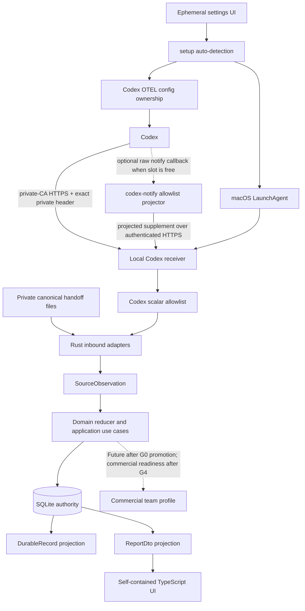

# Architecture and Engineering Principles

이 문서는 agent-observability의 목표 기술 스택, 책임 경계, 설계 원칙의 정본이다.
현재 릴리즈 상태와 작업 순서는 `ROADMAP.md`가 담당하고, 이 문서는 구현 방식과 의존성
규칙을 담당한다.

## Current and target stack

현재 `v1.8.1`은 **Released**다. macOS standalone은 Codex, Claude Code와 Cursor의 private
handoff 수동 import를 daemon과 network 없이 계속 제공한다. 선택적 Codex automatic path는 private-CA
HTTPS와 exact private random request header로 인증하는 `127.0.0.1` OTLP/HTTP JSON receiver,
pre-transport projected notify supplement와 LaunchAgent를 추가한다. 이 transport는 mTLS가 아니다. Rust 경로는
closed contract, deterministic lifecycle reduction, topology validation, pricing/report projection, bounded
input과 private embedded transaction, static HTML assembly를 구현한다. SQLite `local_state.v4`가 source
cursor, stable observation, current reduced record, adapter disposition과 profile-neutral delivery outcome의
정본이며 JSONL과 HTML은 projection이다. Claude Code/Cursor automatic collection과 commercial team
envelope, outbox, collector/network는 활성 계약이 아니다.

목표 스택은 다음과 같다.

| Area | Target | Responsibility |
| --- | --- | --- |
| Domain, application, adapters, storage, export, CLI, optional collector/query API | Rust | canonical schema, lifecycle reduction, privacy, cost, ingestion, local/team artifacts |
| Static report and local settings web UI | TypeScript | sanitized report/config DTO 조회, filtering, policy visualization, interaction |
| Rust-TypeScript boundary | Versioned JSON schema | generated or validated types, compatibility fixtures |

제품 소스는 UI의 TypeScript와 그 외 영역의 Rust로 제한한다. Node.js는 strict TypeScript 빌드,
테스트와 릴리스 도구를 실행할 때만 사용한다. 브라우저·Rust embed용 JavaScript는 TypeScript 또는
schema에서 생성된 추적 가능한 artifact만 허용하며 직접 편집하지 않는다. CI는 사용자 작성
`.js`, `.mjs`, `.cjs`가 다시 들어오지 않도록 허용 목록을 검사한다.

배포 경계도 같은 원칙을 따른다. GitHub Release archive와 GitHub Packages npm package는
동일한 universal Rust executable을 운반한다. npm metadata의 `bin`은 실행 파일을 직접
가리키며 JavaScript launcher 또는 runtime dependency를 추가하지 않는다. Optional Codex automatic
collection의 Rust collector는 같은 executable의 private `collector-serve` mode로 LaunchAgent가 실행한다.
배포 형식은 transport일 뿐 domain/application/runtime 책임을 소유하지 않는다.

TypeScript UI는 브라우저에서 직접 원본 event log를 읽지 않고 Rust가 만든 sanitized report 또는
versioned config DTO만 사용한다. report는 self-contained static HTML이며 runtime web server를
요구하지 않는다. 설정 UI는 CLI가 명시적으로 시작한 동안에만 `127.0.0.1:0`에 bind하는 ephemeral
inbound adapter를 사용한다. token, exact Host/Origin, body bound, no-store와 optimistic revision을
검증한다. HTTP/1 header read는 5초, 동시 연결은 64개, 종료 drain은 1초로 제한해 불완전한
network 연결이 connection task와 drain을 무한히 늘리지 못하게 한다. token은 같은 tab의 reload
복구를 위한 session storage에만 유지한다. 확인된 명시적 종료, invalid session,
bootstrap/heartbeat/config mutation network failure에는 삭제하고 종료 요청 실패에는 재시도를 위해 유지한다.
persistent daemon이나 외부 network 경로를 만들지 않는다. CLI composition root가 private
runtime을 설치하고 `InstalledLayout`을 local-ui에 주입한다. local-ui는 UI instance lock만 유지하고
모든 지원 CLI/UI writer는 설정 mutation 동안 타입으로 강제된 shared guard를 획득한 뒤 그 안에서
읽기와 atomic replace를 수행한다. UI는 추가로 browser revision을 atomic replace 직전에 확인한다.
`config.json` 직접 편집은 지원 경계 밖이다.

## Deployment profiles

제품은 하나의 core를 두 개의 독립된 composition root로 조립한다.

| Profile | Status | Required runtime | Storage | UI |
| --- | --- | --- | --- | --- |
| `standalone` | Implemented product profile | Rust CLI; optional macOS local collector for Codex automatic mode | private embedded transactional state + JSONL/snapshot projections | self-contained report + ephemeral loopback settings UI |
| `team` | Future TODO target; not implemented | local Rust CLI/forwarder + optional collector | planned local state/outbox + tenant/workspace-scoped central store | planned hosted report or self-contained export using the shared TypeScript UI contract |

`standalone`은 기본이자 완전한 제품 경로다. Manual handoff import, 비용 추정과 report 생성은 login,
network, daemon, collector 또는 central database 없이 모두 동작한다. Codex automatic mode를 선택한
경우에만 local LaunchAgent와 loopback receiver가 추가된다. 이 receiver는 외부 interface에 bind하거나
외부 request를 만들지 않는다. Team profile의 장애나 설정 부재가 local write와 local report를
막아서는 안 된다.

아래 `team` 항목은 구현 현황이 아니라 Future TODO의 필수 설계 계약이다. Team 구현은 같은 domain
의미를 재사용하되 local durable contract와 전송 계약을 분리해야 한다.

- 전용 team projector가 domain/application state에서 허용된 관측 필드만 골라
  `TeamIngestEnvelopeV1`을 만든다. `DurableRecordVx`를 입력이나 envelope payload로 사용하지
  않는다.
- local content logging opt-in과 무관하게 `SourceObservation`, `content`, 원문
  prompt/output/tool data, 로컬 파일 내용은 envelope에 들어갈 수 없다.
- envelope는 schema version, requested workspace reference, idempotency key, client timestamp와
  allowlisted observation fields만 담는다. authoritative source identity는 credential에서
  server-side로 결정한다.
- local projector가 전송 전에 privacy를 적용하고, collector는 schema/scope/privacy allowlist를
  다시 검증한다.
- collector는 인증 주체에서 tenant를 결정하고 requested workspace membership과 role을
  검증한다. actor attribution은 인증 주체와 server-side mapping으로 정하며 client claim을
  그대로 저장하지 않는다.
- persistence와 query는 항상 server-resolved tenant/workspace predicate를 포함한다. 다른
  tenant/workspace에 대한 ingest와 query는 deny하고 negative isolation fixture로 검증한다.
- collector는 authorization, tenant isolation, deduplication, retention, audit와 query를 소유한다.
- standalone과 team query는 모두 `ReportDtoVx`를 만든다. TypeScript UI는 pricing, privacy,
  completeness 또는 전체 report aggregate 의미를 다시 구현하지 않는다. UI filter 결과는 DTO의
  sanitized span과 Rust가 이미 계산한 scalar/status만 축약하는 presentation-only view reduction이다.
- collector 전송은 retry-safe outbound port다. 실패하면 bounded local queue에 남기되 local
  observability 경로는 계속 동작한다.
- source cursor, stable event identity, local record와 optional team outbox는 한 local transaction으로
  commit한다. JSONL/snapshot/HTML은 재생성 가능한 projection이며 pending delivery authority가 아니다.
  Local-only train은 profile-neutral delivery outcome port와 `not_applicable` state까지만 구현하며 team
  envelope/outbox/network adapter는 Future TODO G0 promotion 전에는 생성하거나 활성화하지 않는다.
- idempotency uniqueness scope는 server-resolved tenant/workspace + source ID + key다. 같은
  key의 동일 payload hash는 성공으로 재응답하고, 다른 hash는 conflict로 거부한다.
- server receipt time을 authoritative ingest time으로 기록하고 client time은 관측값으로만
  보존한다. tenant별 request/record 크기, ingest rate, storage/retention quota를 적용하며
  poison record는 재시도하지 않는 terminal diagnostic으로 분류한다.

team profile 구현은 roadmap의 Future TODO promotion gate를 통과한 뒤 시작한다. 하지만 domain,
identifier, privacy, schema evolution은 team 확장을 막지 않도록 지금부터 profile-neutral하게
설계한다. Team의 tenancy, identity, API, storage, retention, security, reliability와 commercial
readiness gate는 [TEAM_ARCHITECTURE.md](TEAM_ARCHITECTURE.md)를 정본으로 한다.

## Architectural style

기본 구조는 ports and adapters와 functional core / imperative shell의 조합이다.

v1.8.0의 Rust 경로는 `crates/domain`, `crates/contracts`, `crates/adapter-codex`,
`crates/adapter-claude-code`, `crates/adapter-cursor`,
`crates/application`, `crates/codex-config`, `crates/codex-integration`, `crates/local-collector`, `crates/local-store`,
`crates/local-runtime`, `crates/local-ui`, `crates/static-report`, `crates/cli`와 release
evidence runner인 `xtask`로 나뉜다. domain은 외부 형식을
모르고, contracts는 transient
source와 durable/report DTO 경계를 소유한다. application은 pricing과 report projection을,
inbound adapters는 제품별 source precedence/correlation/dedupe와 raw-to-allowlisted-scalar projection을,
codex-config는 user-level Codex 설정의 exact ownership/restore를, codex-integration은 config/LaunchAgent/
health lifecycle을 하나의 CLI/UI use case로 조립한다. local-collector는 standalone automatic mode의
별도 composition root로서 private-CA HTTPS + exact-header loopback 수신, durable commit과 report refresh를,
local-store는 SQLite transaction과 JSONL
projection을, static-report는 generated UI asset의 self-contained artifact 조립과 private atomic write를,
local-ui는 authenticated loopback config/integration inbound adapter와 embedded generated asset을, local-runtime은
blocking config I/O를 캡슐화한 standalone config use-case를 소유한다. CLI는 foreground/manual composition
root를, local-collector는 automatic collector composition root를 소유한다.
local-ui handler는 이 use-case를 blocking executor에서 호출하고 HTTP 연결 task는 최대 64개로 제한한다.
`contracts/*.schema.json`은 closed wire contract이고 versioned config fixture와 전체 bounds parity
corpus가 strict Rust wire DTO와 생성된 TypeScript validator의 required/default/min/max/unknown-field
일치를 잠근다. `contracts/contract-manifest.v1`은 현재
활성 schema path/version과 `team_ingest=disabled` 경계를 runtime 중립적으로 고정한다.

경계 계약은 이름과 소유권을 분리한다.

- `SourceObservation`: inbound adapter가 만드는 비영속 입력. source payload의 의미를
  canonical field로 번역하지만 durable artifact로 직접 쓸 수 없다.
- domain lifecycle state: reducer가 소유하는 유효 상태와 transition. serialization 형식이 아니다.
- `DurableRecordVx`: local event log와 snapshot에 쓰는 versioned allowlist contract.
- `TeamIngestEnvelopeV1`: 첫 team 전송 전용 versioned allowlist contract. local
  `DurableRecordVx` 전체나 `content` field를 포함하지 않고 collector가 검증할 workspace
  reference, idempotency와 관측 필드만 포함한다. Authoritative source identity는 collector가
  credential에서 resolve해 stored record에 추가한다.
- `ReportDtoVx`: 가격과 집계를 적용한 뒤 UI에 전달하는 별도의 versioned allowlist contract.
- local transactional state: source generation/cursor, stable observation identity, canonical record,
  bounded adapter disposition과
  optional outbox를 원자적으로 소유하는 runtime authority. 외부 wire contract가 아니다.

재시작 후 source를 정확히 이어 읽기 위해 raw source cursor는 private SQLite control state에만
가역 보존한다. DB와 상위 directory는 각각 `0600`/`0700`을 강제한다. Source generation과 관측
identifier는 해시하며, raw cursor는 `DurableRecordVx`, JSONL, report, diagnostic 또는 전송 경계에
투영하지 않는다.

`DurableRecordVx`와 `ReportDtoVx`는 각각 명시적인 fail-closed projector를 통과한다. 한쪽의
privacy 검증을 다른 쪽이 암묵적으로 상속한다고 가정하지 않는다. canonical이라는 표현은
agent 간 공통 의미를 뜻하며, 위 네 계약을 하나의 범용 구조체로 합친다는 뜻이 아니다.

### Domain

Domain은 agent나 저장 방식에 종속되지 않는 의미를 소유한다.

- trace, session, turn, model request, tool operation, permission, compaction
- opaque identifiers와 명시적인 correlation fields
- token usage의 total과 breakdown 의미
- lifecycle state와 허용되는 transition
- topology와 canonical contract invariant

Domain은 파일 시스템, JSONL, HTML, CLI, 특정 agent payload, 단가표 파일 위치를 알지 않는다.
유효하지 않은 상태는 가능하면 타입으로 표현할 수 없게 만들고, 외부 입력 오류는 명시적인
`Result`로 반환한다.

### Application

Application은 use case와 순서를 소유한다.

- source event normalization 실행
- deterministic lifecycle reducer와 topology validation 순서
- storage port가 보장해야 하는 replay/idempotency와 atomic commit 계약 정의
- durable record와 report DTO의 독립된 privacy projection 요청
- pricing policy를 통한 예상 비용 계산
- report DTO 생성

Application은 구체적인 파일 writer나 agent parser를 직접 생성하지 않고 좁은 port에
의존한다. 한 use case가 parsing, storage, UI formatting을 동시에 소유하지 않는다.
SQLite adapter는 이 계약을 한 transaction으로 실행하고 JSONL materialization을 직렬화하지만,
lifecycle/topology 의미와 privacy projection 규칙을 자체 구현하지 않는다.

### Inbound adapters

Codex, Claude Code, Cursor adapter는 각 source format을 canonical observation으로 번역하는
anti-corruption layer다.

- source format 차이는 adapter 내부에서 끝난다.
- source format version과 unsupported event는 명시적인 diagnostic으로 남긴다.
- downstream consumer가 agent별 ID prefix를 파싱하지 않도록 `session_id`, `turn_id`,
  `operation_id` 등을 명시적으로 채운다.
- 원문 prompt, output, command, diff, file content를 canonical metadata로 가장하지 않는다.
- Codex automatic notify helper는 raw notify를 settings/socket 접근 전에 closed content-free wire object로
  축약한다. Receiver는 bounded raw OTLP JSON을 process memory에서 decode한 뒤 `conversation.id`,
  `turn.id`, model, bounded tool category, request/call ID, decision, duration, token
  counts와 success처럼 명시적으로 소유한 scalar만 canonical adapter에 복사한다. Raw body, prompt,
  response, tool arguments/output, command, cwd, path, account identity와 unknown attribute는 persist,
  log, diagnostic, projection 또는 export하지 않는다.
- 같은 contract fixture suite를 모든 adapter에 적용한다.
- Codex의 `api_request`와 `sse_event(response.completed)`는 같은 request ID로 correlate하되
  transport attempt와 completed response를 별도 span으로 유지한다. usage는 completed response에만
  두며, 동일 canonical span의 재전달만 adapter에서 억제한다.
- unsupported, content-ignored와 duplicate-suppressed 입력도 raw payload 없이 fixed enum만
  `adapter_dispositions`에 기록하며 같은 transaction에서 cursor를 진행한다.
- Codex notify helper는 최대 64 KiB의 raw input을 받은 뒤 settings 또는 socket 접근 전에 더 작은 closed
  content-free projection으로 축약한다. 이 projection만 private-CA HTTPS와 exact private request header로
  loopback receiver에 전달하며 전체
  connect/TLS/HTTP deadline 뒤 항상 fail open한다. 외부 network, full transcript parse, report render나
  queue drain을 기다리지 않는다. Future file fallback은 persisted cursor와 source generation으로
  incrementally reconcile한다.
- 제품별 공식 source 우선순위와 지원 evidence는
  [`ADAPTER_COMPATIBILITY.md`](ADAPTER_COMPATIBILITY.md)를 따른다.
- Manual Rust adapter 입력은 private regular JSONL file로 제한하며 최대 1 MiB, 4096 record,
  record당 64 KiB다. group/other permission이나 symbolic link는 거부한다. Codex automatic OTLP/HTTP
  JSON request도 최대 1 MiB와 4096 log record로 제한하며 같은 canonical mapper에 합류한다.
  Claude Code와 Cursor에는 automatic receiver나 foreground producer가 아직 없다.

### Outbound infrastructure

파일 시스템, JSONL, snapshot, report artifact 같은 I/O를 구현한다.

- event log/snapshot write와 report artifact write는 각자의 fail-closed projector를 반드시
  통과한다.
- projector가 허용하지 않은 field는 저장하지 않으며 diagnostic 또는 validation error로
  처리한다.
- diagnostic, queue, export, collector payload도 같은 원칙의 전용 allowlist contract를
  사용하며 source의 원문 오류 문자열이나 unknown metadata를 그대로 전달하지 않는다.
- append/replay는 embedded transaction의 deterministic source observation key, stable event ID와 cursor로
  중복과 crash recovery를 통제한다.
- local artifact path의 상위 directory와 file은 각각 private permission `0700`과 `0600`이어야
  한다. writer는 느슨한 기존 directory를 임의 변경하지 않고 쓰기를 거부하므로 호출자는 전용
  artifact directory를 전달해야 한다.
  기존 v0.6 writer는 parity 대상이 되기 전에 이 조건을 충족해야 한다.
- 손상된 trailing record와 schema migration 정책을 명시적으로 처리한다.

### Local Runtime

- standalone 설정은 `local_runtime.v2` strict JSON이다. 기존 v1은 retention 기본값으로 호환
  로드한다. 팀 identity, 이메일, endpoint와 transport
  설정은 포함하지 않는다.
- Codex automatic integration은 별도 private `runtime/collector.json`,
  `runtime/integrations/codex/tls` credential tree와
  `runtime/integrations/codex/codex-config-ownership-v1.json`을 사용한다. Collector settings은 private
  random 256-bit request-header value와 bounded credential path metadata를 소유하고 PEM body를 넣지
  않는다. Receiver는 IPv4 loopback에만 bind한다. Codex와 내부 probe는 private CA가 서명한
  server certificate와 IP SAN을 검증하고, `/health`, `/v1/logs`, `/v1/notify` request는 exact
  `x-agent-observability-token` header를 제공해야 한다. Codex exporter에 client certificate/private-key
  field를 구성하지 않으며 transport는 mTLS가 아니다. 외부 network client는 없다. 같은 OS user가
  private header secret이나 server key를 읽을 수 있는 위협은 이 경계 밖이며 별도 account 또는
  sandbox가 필요하다.
- 인자 없는 `setup`은 real Codex home 또는 PATH의 executable을 읽기 전용으로 감지한 뒤에만 automatic
  connection을 시작한다. 감지되지 않으면 Codex home/config/collector service를 만들지 않는다.
  명시적 `connect codex`는 collector LaunchAgent를 준비하고 health를 확인한 뒤 Codex config를 변경한다.
  v2 mTLS에서 v3로 바뀌는 경우 settings migration journal이 exact prior bytes/mode와 credential
  generation을 보존한다. LaunchAgent와 Codex config commit 전에는 legacy credential을 지우지 않으며,
  실패 시 config 해제와 service rollback이 모두 확인된 뒤에만 settings와 replacement credential을
  복원·정리한다. 보상 실패 시에는 v3 settings, journal, credential을 유지해 실행 중 참조를 깨지 않는다.
  service install/restart 또는 commit 결과가 불확실한 오류도 같은 방식으로 보존하고 다음 lifecycle
  command가 LaunchAgent ownership phase를 먼저 복구한다.
  성공 시 durable `integration_committed` phase를 기록한 뒤에만 obsolete generation과 journal을
  fsync하며 제거한다. `status`와 `disconnect`는 settings parse 전에 남은 journal과 config ownership을
  조정하며 committed phase는 이전 settings로 되돌리지 않는다.
  `$CODEX_HOME/config.toml` 또는 기본 `~/.codex/config.toml`의 exact prior/connected bytes, hash, mode와
  transaction phase를 private ownership snapshot에 보존한다. 항상 관리하는 값은 `otel.exporter`,
  `otel.log_user_prompt=false`, `otel.environment="local"`이다. top-level `notify`가 비어 있을 때만 agentobs
  notify를 추가 소유하며 기존 valid non-empty string-array notify는 그대로 보존하고
  `external_preserved`로 보고한다. malformed notify 또는 기존 OTEL 값이 다르면 connect는 config를
  수정하지 않고 conflict로 중단한다. `disconnect codex`는 LaunchAgent 종료를 먼저 확인하고 commit 전
  반복 검사에서 현재 전체 bytes/mode가 snapshot의 connected state와 같을 때만 이전 bytes/mode를
  복원하거나 연결 전 파일이 없었다면 제거한다. 검사에서 관측된 edit는 보존한다. agentobs writer는
  lock으로 직렬화하지만 arbitrary non-cooperating open-descriptor write를 배제하는 portable filesystem
  CAS는 제공하지 않는다. Crash
  phase는 다음 lifecycle command에서 복구하며 conflict와 rollback failure는 사용자 설정을 덮어쓰지 않는다.
- The ephemeral settings UI exposes the same `codex-integration` status/connect/disconnect use cases and can
  open an existing private report. Integration mutations require the same private UI session plus exact Host
  and Origin checks as config mutation. Closing the UI does not disconnect a previously installed LaunchAgent.
- LaunchAgent label은 runtime root hash로 분리한다. Private ownership transaction은 prior plist
  bytes/mode, prior loaded state, desired state와 phase를 기록하고 reconnect·disconnect·crash recovery에서
  정확한 이전 상태를 복원한다. 새 설치가 소유한 plist만 제거하며 inherited 또는 이전 정상 service를
  역명령으로 파괴하지 않는다. Local SQLite와 report는 보존한다. Automatic collection은 현재 macOS
  Codex만 지원한다.
- Automatic collector는 source-ordered observation/disposition을 한 SQLite transaction에 commit한다.
  Ingest와 retention을 포함한 current-record mutation은 durable report generation을 같은 authority에서
  증가시킨다. Renderer는 generation-consistent snapshot을 쓰고 exact generation만 acknowledge한다. Private
  marker는 wakeup hint일 뿐이며 startup은 미확인 generation을 재조정한다. Retry exhaustion은 authenticated
  health와 CLI/UI에 degraded 상태로 나타난다.
- composition root는 `setup`에서 private install layout, collection policy, singleton lock,
  SQLite authority, storage admission, first report와 local browser open을 결합한다. `demo`는
  별도 runtime과 embedded content-free fixture만 사용한다. `config set`은 local-runtime의
  validated atomic save boundary를 통해 다음 one-shot command에 적용한다.
- 설치 루트를 받는 ingest command는 같은 strict config와 singleton을 실제 write 전 과정에 적용한다.
- foreground ingress는 1 MiB raw input, 64 KiB projected message, 64-slot channel과 one normalization
  writer로 고정한다. full/unavailable/oversized는 nonblocking fail-open outcome이다. `xtask`의
  drain은 단일 CPU execution token 아래 최대 32-record, 512 KiB batch를 처리한다. active batch와
  64 KiB pending message를 포함한 durable handoff payload 상한은 576 KiB이며, 64-slot ingress까지
  포함한 전체 pipeline 상한은 약 4.6 MiB다. release fixture는 baseline과 enabled에 동일한 3 ms driver inter-arrival
  schedule을 적용해 지원 처리율의 합산 CPU를 비교하고, 이어지는 enabled-only unpaced saturation pass로
  rejection, latency, bounded memory, durable reconciliation을 별도 검증한다. 두 pass 사이 durability
  barrier가 supported accepted event의 commit 완료를 보장해 CPU와 backlog 귀속을 분리한다. supported CPU는
  첫 command부터 barrier 완료까지 측정해 accepted commit tail을 포함한다. 이 schedule은 제품 내부
  pacing이나 device-wide CPU 보장으로 해석하지 않는다. 현재 이 foreground
  ingress/drain composition은 `xtask` release fixture가 검증하며, CLI handoff ingest는 이미 만들어진
  bounded batch를 singleton 아래 transaction store에 직접 반영한다. Release fixture는 enabled saturation의
  fail-open rejection을 1% 이하로 제한하고 graceful shutdown 뒤 enqueued count와 durable observation
  count를 대조한다. macOS network evidence는 run마다 하나의 PTY-backed `nettop` monitor를 worker 전체
  생명주기 동안 유지하며, 다음 header가 닫은 완전한 cycle만 evidence로 승인한다. resource sample은
  3초보다 오래되지 않은 최신 완료 누적값을 읽고, 닫힌 socket 뒤에도 이전 traffic이 사라지지 않도록
  run 최대값을 보존한다. durable drain 완료 뒤 시작된 cycle 하나가 완전히 닫힌 것을 확인한 다음 worker를
  release한다. Linux는 각 resource sample과 drain 뒤에 worker socket descriptor를 point-in-time으로
  검사하며 continuous byte monitor로 간주하지 않는다. drain evidence marker는 worker가 drain command를
  받은 뒤에만 만들고, drain 완료와 parent-confirmed final resource sample까지 유지한 다음
  `drain-complete` 전에 제거한다. sampler result, worker protocol/exit, local process query와 monitor shutdown
  wait는 bounded이며 완료된 sampler/output-reader thread를 join한다. Foreground enqueue 자체는 durability를
  보장하지 않는다.
- 저장소 용량은 allocated block과 worst-case write로 admission한다. age retention은 strict 설정의
  1..3650일, archive pass당 1..100,000 record와 64 KiB..256 MiB bounds를 사용한다.
- retention은 cutoff와 같거나 더 새로운 observation이 있는 trace와 unresolved topology를 보존한다.
  cutoff 이후 관측이 없는 trace는 lifecycle 상태와 관계없이 complete trace 단위의 deterministic order로
  private JSONL archive에 먼저 streaming 내구화하고, 같은 immediate transaction에서
  observation/source-input/delivery/current-record/topology rows를 물리 삭제한다. source cursor와 compact
  canonical span-state hash를 별도 table에 보존해 bounded semantic replay idempotency를 유지한다.
  typed observation retention columns와 persistent indexes가 selection을 full JSON scan과 trace별 반복 scan에서
  분리한다. commit 뒤 archive 크기의 최대 16배 page까지만 incremental vacuum으로 회수한다.
  v1/v2/v3 migration은 legacy disposition을 먼저 bounded horizon으로 줄이고, schema version 변경 전에
  incremental auto-vacuum 활성화를 위한 atomic full rewrite를 한 번 수행한다. 일반 store open은 legacy
  migration을 거부한다. 제품 CLI는 configured budget의 남은
  용량과 실제 filesystem available space 중 작은 값을 migration workspace로 명시 전달하며, DB 크기의
  두 배보다 작으면 rewrite나 schema-version 변경 전에 fail closed한다.
- `retention-plan`의 selection은 retention authority를 변경하지 않고 deterministic plan ID를 반환한다.
  하나라도 bounds를 넘는 eligible trace가 있어 `truncated=true`이면 apply는 selected prefix까지 전부
  거부하며, 더 큰 bounded limit으로 새 plan을 만들어야 한다.
  단, CLI store open은 최초 schema 초기화/migration과 dirty projection repair를 수행할 수 있다.
  automatic collector startup과 HTML refresh는 non-authoritative JSONL repair를 수행하지 않으며,
  current-schema report connection은 전체 `integrity_check` 대신 필요한 version/generation metadata와
  실제 report query 실패로 fail closed한다.
  `retention-apply`는 같은 UTC-day cutoff와 현재 authority에서 plan ID를 재검증한다. archive 경로는 managed
  runtime root 밖이어야 하며 parent/file은 각각 0700/0600이어야 한다. archive file sync가 SQLite
  mutation보다 먼저다. archive는 temporary sync 후 no-overwrite link로 publish하고 header/footer 및
  record digest를 포함한다. commit 전 실패로 archive만 남으면 그 파일은 valid duplicate export로 취급하고
  새 경로로 재시도한다. commit transaction의 applied-plan receipt는 authority 재선택보다 먼저 확인하며,
  이후 incremental compaction 실패를 같은 plan ID와 archive path로 재개하고 원래 archive 경로를 반환한다.
  pending receipt가 있으면 해당 receipt 복구 외의 새 pass를 차단한다. expired span guard와 content-free
  disposition은 각각 최신 100,000개, 완료 receipt는 최신 1,024개로 제한된다. receipt 완료와 completed
  ledger pruning은 한 transaction으로 commit한다. archive write 전에는 archive parent당 하나의 stable
  exclusive lock을 잡고 해당
  archive 이름으로 crash-left private temp를 bounded total directory scan으로 정리한다. guard horizon 밖의 과거 cursor
  replay는 source cursor 계약에서 fail-closed conflict가 되며, 새 cursor semantic replay 보호는 horizon 안에서만
  suppression/conflict를 보장한다.
- v1.2에서 expired record는 이후 local report aggregate에서도 제외된다. Correction, retraction,
  reinstate, restore와 retention 전후 deterministic aggregate rebuild는 미지원이다. 해당 Future TODO를
  승격하기 전 privacy-safe contribution journal과 versioned checkpoint를 raw expiry보다 먼저 구현한다.
- SQLite authority는 `projection_dirty`를 transaction에 포함하고 clean reopen에서 전체 projection
  rebuild를 생략한다. 자세한 운영 계약은 [LOCAL_RUNTIME.md](LOCAL_RUNTIME.md)를 따른다.

### Web UI

Web UI는 TypeScript `strict` mode를 사용한다.

- UI는 privacy 판단과 가격 계산을 다시 구현하지 않는다. 전체 report aggregate는 Rust DTO를
  authoritative source로 사용한다.
- Rust가 생성한 sanitized report DTO만 입력으로 받는다.
- DTO type은 versioned schema에서 생성하거나 runtime validation으로 확인한다.
- 브라우저에서 외부 network 요청이나 상시 server 없이 동작한다.
- agent별 예외 처리는 UI가 아니라 canonical contract나 adapter에서 해결한다.
- Rust outbound infrastructure는 빌드된 TypeScript UI asset과 `ReportDtoV1`을 하나의
  self-contained HTML artifact로 조립한다. `report <runtime-root> [rate-table-json]`은 SQLite의 typed
  snapshot을 bounded transaction과 generation fence로 record batch 단위로 읽고, SQLite read lock을
  닫은 뒤 privacy-safe span으로 즉시 축소한다. source record 전체를 별도 vector로 유지하지 않으며,
  검증된 DTO JSON과 HTML shell은
  완성된 중간 문자열 없이 private temporary file로 streaming한 뒤 고정된 logs 경로에 원자 기록한다.
  Node.js는 build/test에서만 사용된다.
- Automatic collector의 report refresh는 ingest quiet period 뒤 최신 generation을 한 번 렌더한다.
  연속 ingest 중 성장하는 전체 report를 주기적으로 다시 만들지 않으며, 새 commit이 render와
  겹치면 stale generation을 acknowledge하지 않고 quiet-period 수렴을 다시 예약한다.
- team profile의 hosted UI도 같은 `ReportDtoVx` schema와 UI component를 사용한다. transport와
  authentication/authorization만 profile별 composition root에서 달라진다. hosted query는
  server-resolved tenant/workspace scope 밖의 DTO를 생성할 수 없다.
- standalone report는 team/workspace를 client-side field에서 추론하거나 filter로 제공하지 않는다.
  local scope는 고정이며, hosted team scope는 Future TODO promotion 뒤 서버가 결정해 scope bar로
  제공한다. v0.12 filter dimension은 sanitized repo, session, agent와 model이다.
- v1.1 build는 canonical report schema에서 TypeScript declaration과 standalone validator를
  생성하고 strict TypeScript UI를 하나의 browser IIFE로 bundle한다. HTML은 DTO와 bundle을 직접
  삽입하며 runtime network request를 만들지 않는다.
- v0.12 producer는 `filters.agents`와 `filters.models`를 출력한다. 두 필드는 additive optional v1
  fields로 정의해 이전 v1 report를 계속 읽고, 이전 report에서는 UI가 sanitized span agent/model
  값으로 filter option만 재구성한다.
- filter KPI와 trace row는 현재 필터에 남은 sanitized span의 count/token/error와 이미 가격이 계산된
  `estimatedCost`만 축약한다. cost completeness는 span별 `cost.status`를
  `contracts/report-view-reduction-v1.fixture.json` 규칙으로 합치며 Rust와 generated TypeScript reducer가
  같은 fixture를 검증한다. rate lookup, token overlap 또는 가격 계산은 브라우저에 존재하지 않는다.
- v1.1 view-state는 span을 한 번 순회해 filter와 trace group을 함께 만들고, DOM projection은 페이지당
  trace 100개, span 200개, timeline 120개로 제한한다. 이 제한은 화면 렌더링 상한이며 Rust DTO의
  전체 aggregate나 span 집합을 잘라내지 않는다. 각 filter select도 500개 value option으로 제한하고
  초과한 sanitized repo/session/agent/model 값은 text search에서 찾는다.
- 저장 보기는 최대 20개이며 sanitized repo/session/agent/model 차원 중 key별 allowlisted scalar
  grammar를 통과한 값만 versioned envelope로 browser local storage에 기록한다. session은 opaque
  `id:sha256:` 형식만 허용하고 repo/agent는 bounded name, model은 최대 3개 bounded name segment만
  허용한다. text search, trace 선택, email, 원문 content와 local path 형식은 저장하지 않으며
  sentinel fixture로 거부를 검증한다.
  file-origin storage가 허용되지 않는 환경에서도 report 조회와 filtering은 계속 동작한다.
- additive optional field는 새 consumer가 이전 v1 report를 읽는 방향만 보장한다. closed v1 schema를
  가진 N-1 consumer는 새 field를 거부할 수 있으므로 hosted/team transport를 도입하기 전에 contract
  version negotiation 또는 새 DTO version이 필요하다. standalone artifact는 DTO와 동버전 bundle을
  함께 조립한다.
- `npm test`의 `pretest`는 lockfile에 고정된 `playwright-core`가 요구하는 Chromium revision을
  `playwright-core install chromium --no-shell`로 준비한다. smoke는 해당 pinned executable만 사용해
  self-contained `file://` artifact의 desktop/mobile overflow, mobile 44px target, heading/landmark,
  keyboard focus, filter/trace/timeline interaction, 저장 보기 reload/delete, console error와 외부
  request 부재를 검증한다. 4,096-span deterministic fixture는 전체 집계와 bounded DOM을 함께 검증한다. 별도 web
  server나 system browser 탐색은 사용하지 않는다.

Framework는 필요성이 확인될 때 선택한다. TypeScript 자체가 목표이며 특정 UI framework는
현재 architecture contract가 아니다. 사용자, route, component, interaction, accessibility와
responsive 계약은 [DESIGN.md](../DESIGN.md)를 따른다.

## Engineering principles

### SOLID

- Single Responsibility: module과 crate는 하나의 변경 이유를 가진다. 예를 들어 source
  parsing, lifecycle reduction, privacy projection, storage를 한 모듈에 섞지 않는다.
- Open/Closed: 새 agent는 canonical contract를 구현하는 adapter 추가로 수용한다. 기존
  report와 storage에 agent별 분기를 추가하지 않는다.
- Liskov Substitution: 같은 port의 구현은 동일한 error, ordering, idempotency 계약을
  지켜야 하며 contract test로 검증한다.
- Interface Segregation: reader, writer, pricing lookup, clock처럼 실제 소비자가 필요한 작은
  port를 사용한다. 모든 기능을 가진 거대한 context trait을 만들지 않는다.
- Dependency Inversion: application과 domain은 infrastructure에 의존하지 않는다. 구체 구현은
  composition root인 CLI에서 조립한다.

### Object-oriented techniques

Rust에서는 상속 중심 OOP를 사용하지 않는다. 상태와 invariant가 함께 움직여야 할 때 struct와
method를 사용하고, 교체 가능한 경계에는 trait을 사용한다. trait object, generic, builder는
실제 polymorphism이나 construction complexity가 있을 때만 도입한다.

### Functional techniques

Parsing 이후의 normalization, reducer, privacy projection, cost calculation, report projection은
입력과 출력을 명확히 가진 순수 함수로 유지하는 것을 기본값으로 한다. mutation은 reducer
내부처럼 범위가 좁고 성능 또는 상태 전이가 명확한 곳에 제한한다. 시간, 파일 시스템, 환경
변수는 주입 가능한 경계로 다룬다.

### Patterns

기본적으로 허용되는 패턴은 다음과 같다.

- ports and adapters for external formats and I/O
- anti-corruption layer for agent-specific payloads
- reducer/state machine for lifecycle correlation
- strategy/policy for provider and model pricing rules
- repository only when persistence substitution or transaction semantics are required
- composition root in the CLI

패턴 이름을 맞추기 위한 클래스나 trait은 만들지 않는다. 두 번째 구현, 독립 테스트 대역,
실제 변경 축 중 하나도 없다면 concrete function이나 struct를 우선한다.

## Model and pricing compatibility

모델별 조건을 domain 곳곳의 분기로 하드코딩하지 않는다. canonical usage는 최소한 다음 의미를
구분할 수 있어야 한다.

- total input tokens
- cached input tokens
- cache-write input tokens
- total output tokens
- reasoning output tokens
- provider-specific billable units or modifiers

breakdown이 total에 포함되는지 여부는 source adapter와 pricing policy 계약에 명시한다.
v1 parity contract의 pricing identity는 globally qualified canonical model ID와 rate-table version을
사용한다. provider나 service tier에 따라 가격이 달라지는 경우에는 해당 차원을 canonical model
ID/rate key에 포함해야 하며, 구분할 source evidence가 없으면 `estimated`를 반환하지 않는다.
향후 schema가 provider와 service tier를 독립 field로 추가하면 migration fixture로 이 의미를
보존한다. alias와 snapshot은 구분하며, 장문 context 배율이나 cache-write 배율은 versioned pricing
policy로 표현한다. 수집된 billable dimension에 대응하는 규칙이 없으면 결과는 `estimated`가 아니라
`incomplete` 또는 `unknown`이어야 한다.

모델 호환성은 모델명을 인식하는 것만 뜻하지 않는다. fixture는 token semantics, inherited model
identity, unknown model, alias, snapshot, cache breakdown, pricing modifier를 검증해야 한다.

## Maintainability and extensibility gates

- canonical schema 변경에는 migration note와 이전 schema fixture가 필요하다.
- adapter 추가에는 공통 parity suite와 unsupported-event fixture가 필요하다.
- privacy 변경에는 raw sentinel이 log, report, snapshot 어디에도 남지 않는 fixture가 필요하다.
- lifecycle 변경에는 out-of-order, duplicate, interrupted, replay fixture가 필요하다.
- pricing 변경에는 total/breakdown 중복 계산 방지와 incomplete 상태 fixture가 필요하다.
- Rust-TypeScript contract 변경에는 schema compatibility와 static report smoke가 필요하다.
- local runtime 변경에는 hook latency, idle/active CPU, RSS, disk growth, crash-point replay와 queue pressure
  fixture가 필요하다. Budget 초과 시 team sync와 projection을 먼저 늦추고 agent foreground path를
  block하지 않아야 한다.
- architecture boundary 변경은 간단한 ADR 또는 이 문서의 decision section으로 근거를 남긴다.

## Migration status

v0.6 JavaScript 제품 구현은 v1.7.0에서 제거됐다. source input과 contract fixture는 Rust adapter,
domain, application, store와 report 테스트의 compatibility evidence로 유지한다. 새 제품 기능은
Rust와 TypeScript 경계 안에서만 구현하며 두 runtime을 한 요청 안에서 연결하지 않는다.

## Rejected defaults

- agent별 schema와 agent별 dashboard
- downstream consumer의 span ID 문자열 파싱
- 알려지지 않은 metadata를 그대로 저장하는 fail-open redaction
- 전역 mutable state, singleton registry, service locator
- parsing, business rule, storage, presentation을 한 service에 모으는 구조
- 미래 가능성만을 위한 trait, generic, factory, manager 계층
- 모델별 조건을 source code 곳곳에 직접 분기하는 방식
