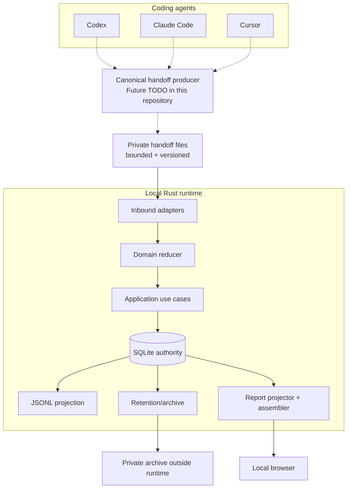
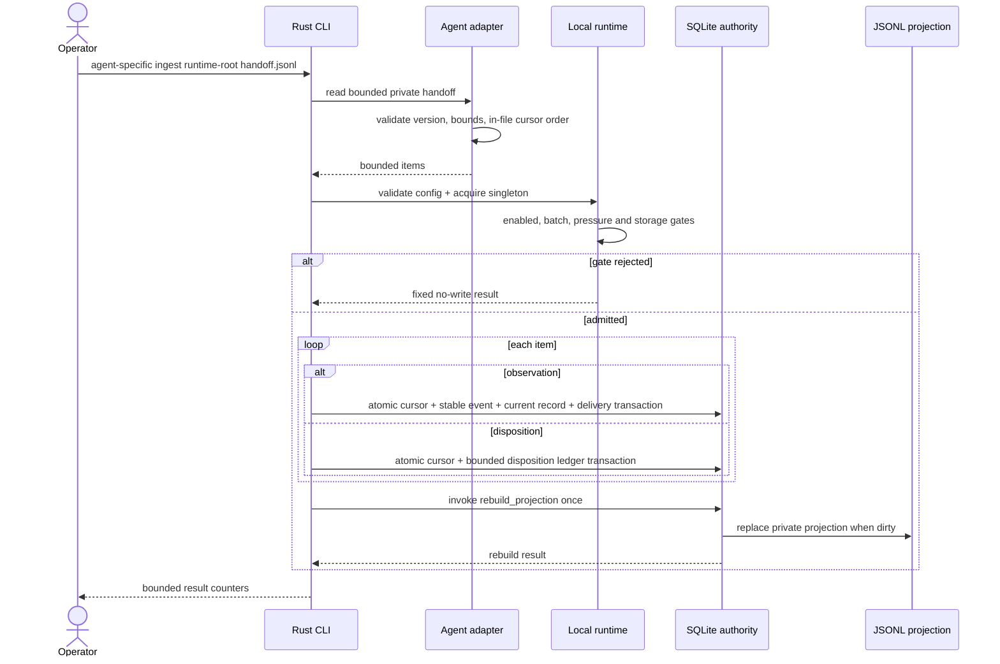
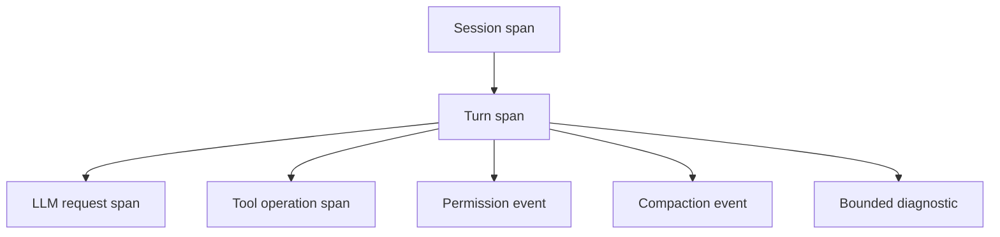
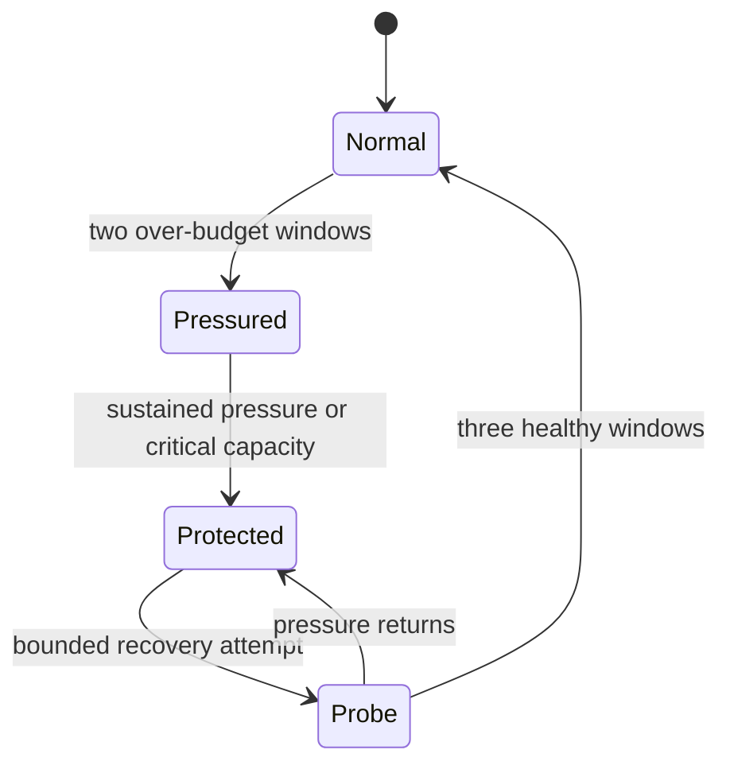
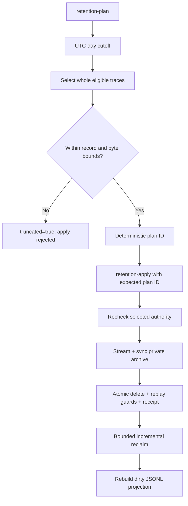
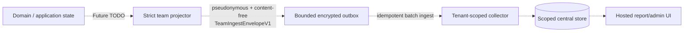

# Collection Flow

이 문서는 agent-observability의 수집, 정규화, durable commit, report와 retention 흐름을 설명한다.
구현 책임과 의존성 규칙의 정본은 [ARCHITECTURE.md](ARCHITECTURE.md), agent별 source 지원 범위는
[ADAPTER_COMPATIBILITY.md](ADAPTER_COMPATIBILITY.md)다.

## Scope Boundary

| Boundary | v1.2 status |
| --- | --- |
| Private canonical handoff parser | Implemented for Codex, Claude Code, Cursor |
| One-shot local ingest CLI | Implemented |
| SQLite authority and JSONL projection | Implemented |
| Static HTML report | Implemented |
| Explicit retention/archive | Implemented |
| Agent hook/log to canonical handoff producer | Not shipped |
| Native telemetry receiver | Future TODO |
| Resident daemon or background service | Future TODO |
| Team collector and hosted query/UI | Future TODO |

현재 release는 agent 제품이 직접 생성한 임의 payload를 바로 읽는다고 주장하지 않는다. 별도 producer가
공식 surface를 versioned canonical handoff로 변환해야 하며, 현재 Rust adapter는 그 private file부터
지원한다.

## System Context

점선 경로는 v1.2 repository가 제공하지 않는 upstream producer boundary다. 실선은 현재 Rust CLI가
구현하고 테스트하는 local-only 경로다.

## Ingest Sequence

### Failure Semantics

- Unknown schema, unsupported version, malformed record와 cursor gap은 조용히 건너뛰지 않는다.
- 동일 stable observation의 retry는 idempotent하고 payload가 바뀐 동일 ID는 conflict다.
- Content나 arbitrary error string은 diagnostic으로 복사하지 않고 bounded reason code를 사용한다.
- 각 항목의 SQLite transaction 전에 실패하면 해당 source cursor를 진행하지 않는다.
- JSONL projection은 authority가 아니므로 dirty state에서 복구할 수 있다.

## Canonical Trace Model

Agent별 correlation key는 adapter가 해석하고 downstream은 ID prefix를 파싱하지 않는다. Codex의
session/turn/request, Claude Code의 prompt/tool use, Cursor의 conversation/generation/tool use 의미는
공통 typed identifier와 lifecycle observation으로 변환된다.

`SourceObservation`은 complete transient type이다. Durable projector는 allowlisted scalar만
`DurableRecordV1`로 만들며 prompt, output, command, path, cwd, raw email과 arbitrary metadata는
durable boundary를 통과하지 않는다.

## Runtime and Backpressure

Foreground work는 bounded local handoff까지만 수행해야 한다. Full, oversized와 unavailable은 명시적
결과이며 network, report render, full transcript scan이나 queue drain을 기다리지 않는다. Pressure가
높아지면 Future team sync와 report refresh를 coding agent 작업보다 먼저 낮춰야 한다.

구체적인 channel, batch, memory와 storage 상한은 [LOCAL_RUNTIME.md](LOCAL_RUNTIME.md#runtime-bounds)를
따른다.

## Report Flow

Browser code는 raw SQLite, JSONL, agent payload나 rate policy를 직접 읽지 않는다. Rust가 만든 DTO를
filter하고 시각화할 뿐이며 가격을 다시 계산하지 않는다.

## Retention Flow

Retention은 trace를 분할하지 않는다. Cutoff와 같거나 이후인 observation이 하나라도 있는 trace와 unresolved
topology는 유지한다. Archive가 publish되고 sync되기 전에 SQLite authority를 변경하지 않으며,
archive는 managed runtime 밖에 둔다.

## Future Team Profile

Team은 standalone을 대체하지 않고 같은 domain semantics 위에 선택적으로 추가한다.

이 경로는 현재 구현이 아니다. Raw email, `SourceObservation`, full durable record, prompt/output/tool
content는 team envelope에 들어가지 않는다. 인증, tenant isolation, RBAC, deletion, key rotation,
audit, quota, restore와 SLO/DR evidence가 모두 G0-G4 gate를 통과해야 한다. Opaque event, identity와
workspace reference는 pseudonymous personal data이므로 authorization, retention과 deletion 대상에서
제외하지 않는다.

## Related Contracts

- [Architecture and Engineering Principles](ARCHITECTURE.md)
- [Adapter Compatibility Contract](ADAPTER_COMPATIBILITY.md)
- [Local Runtime](LOCAL_RUNTIME.md)
- [Team Architecture](TEAM_ARCHITECTURE.md)
- [Team Contracts](TEAM_CONTRACTS.md)
- [Design](../DESIGN.md)
- [Roadmap](../ROADMAP.md)
