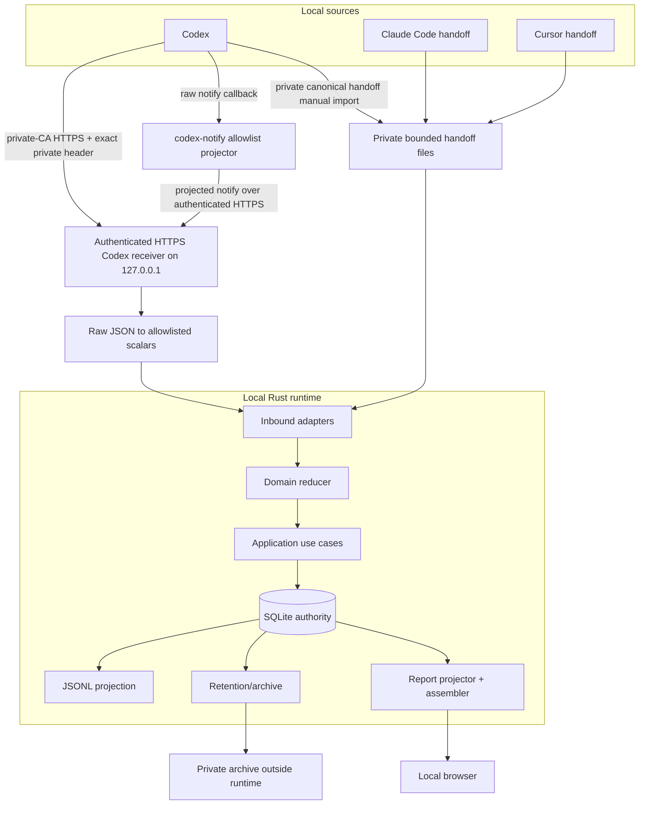
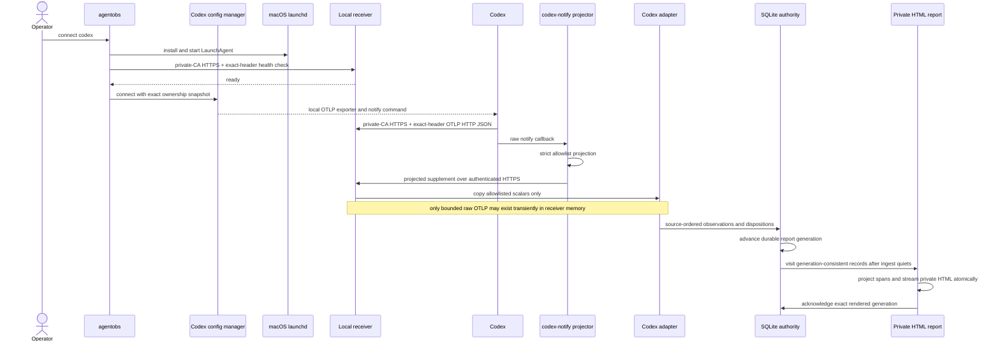
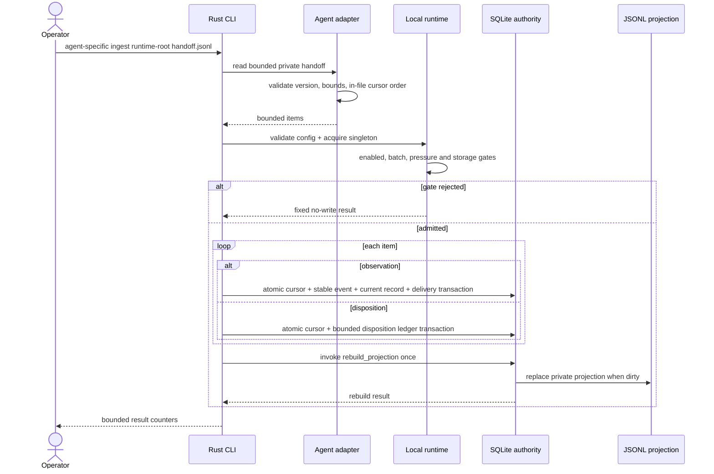
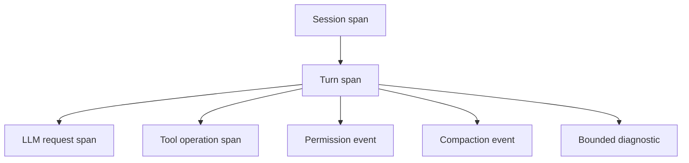
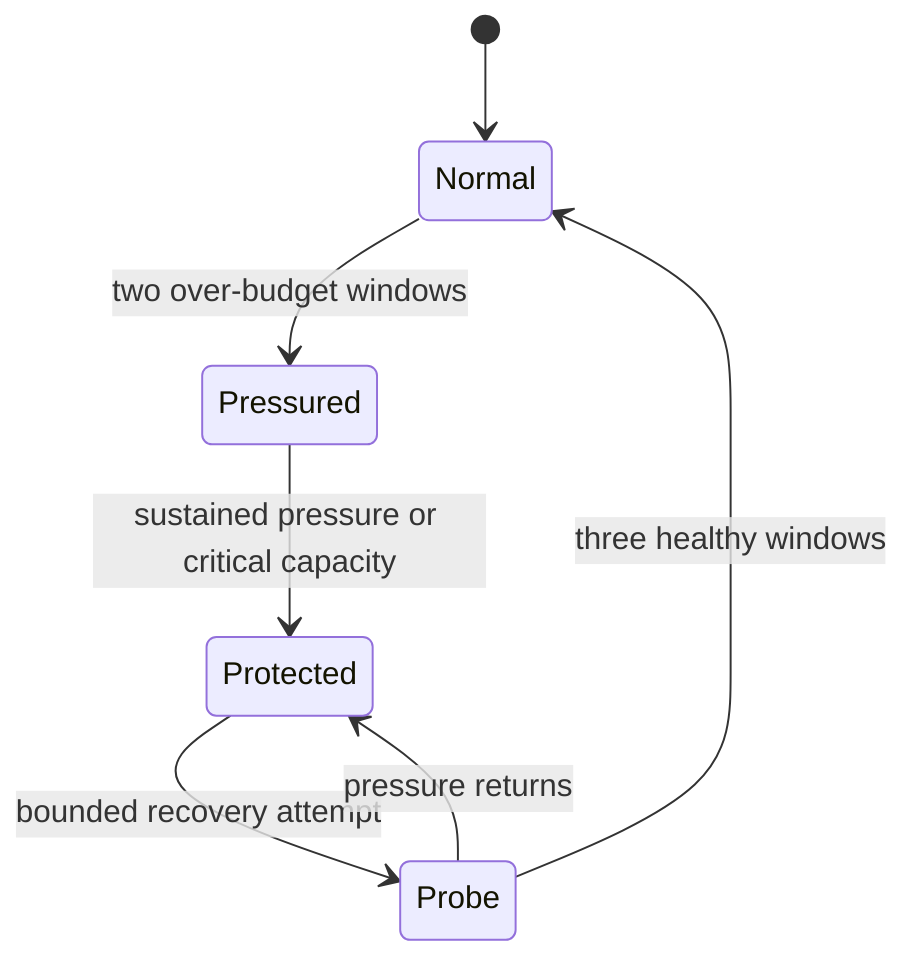
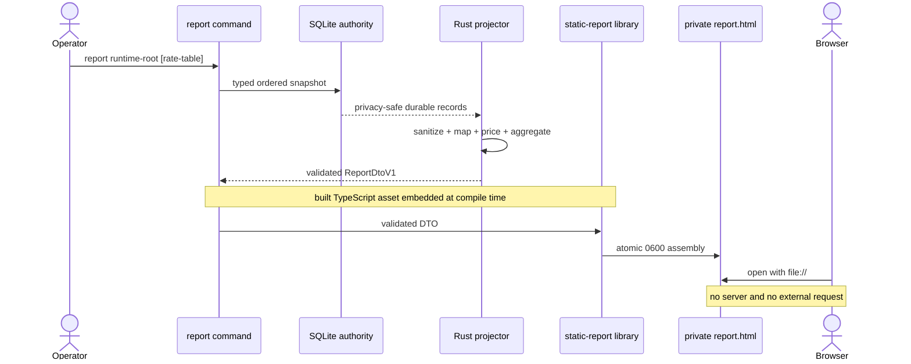
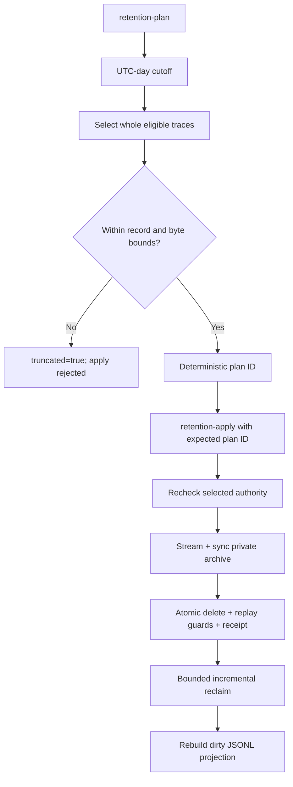
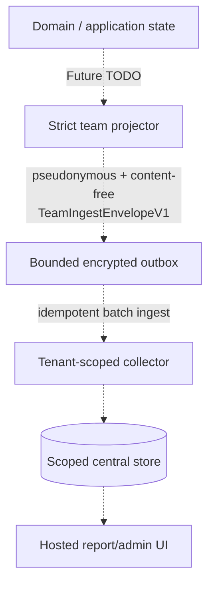

# Collection Flow

이 문서는 agent-observability의 수집, 정규화, durable commit, report와 retention 흐름을 설명한다.
구현 책임과 의존성 규칙의 정본은 [ARCHITECTURE.md](ARCHITECTURE.md), agent별 source 지원 범위는
[ADAPTER_COMPATIBILITY.md](ADAPTER_COMPATIBILITY.md)다.

## Scope Boundary

| Boundary | v1.8.0 status |
| --- | --- |
| Private canonical handoff parser | Implemented for Codex, Claude Code, Cursor |
| One-shot local ingest CLI | Implemented |
| Codex OTLP/HTTP JSON receiver | Private-CA HTTPS on IPv4 loopback with exact private random request header; compatibility correction and release evidence In Progress |
| Codex `agent-turn-complete` notify supplement | Implemented with bounded fail-open local delivery |
| Codex config ownership and macOS LaunchAgent | Implemented with exact restore; release In Progress |
| SQLite authority and JSONL projection | Implemented |
| Static HTML report | Implemented |
| Ephemeral loopback settings UI | Implemented |
| Explicit retention/archive | Implemented |
| Claude Code/Cursor automatic collection | Future TODO; manual imports remain implemented |
| Commercial team collector and hosted query/UI | Future TODO; requires G0-G4 approvals and evidence |

수동 import는 별도 producer가 공식 surface를 versioned canonical handoff로 변환한 private file부터
지원한다. Codex automatic path에서 raw notify는 foreground helper가 transport 전에 projection하고,
receiver는 bounded raw OTLP만 decode해 allowlisted scalar로 즉시 축소한다. Raw payload와 unknown field는
저장하거나 출력하지 않는다.

## System Context

모든 화살표는 local machine 안에 머문다. Claude Code와 Cursor automatic source 연결은 아직 없으며
그 둘은 private handoff 수동 import만 지원한다. Manual path는 receiver나 LaunchAgent 없이 동작한다.

## Codex Automatic Sequence

`setup` prepares and optionally opens the private dashboard before entering this sequence through
`connect codex`. The connect command starts the collector and verifies health before taking Codex config
ownership. A private
LaunchAgent transaction records prior plist bytes/mode and loaded state; failure or crash restores that exact
state instead of unconditionally removing a service. `disconnect codex` first converges the LaunchAgent to its
recorded prior state, then restores the exact prior Codex config only while the complete connected bytes and mode
still match. It retains local observations. Unacknowledged SQLite report generations survive crashes; startup
reconciles them and bounded exponential retries expose an exhausted refresh as degraded health through CLI/UI.
Continuous ingest only advances the durable generation and refresh request epoch; it does not repeatedly rebuild
the growing full report. After one quiet period, the renderer visits source records one at a time, retains only
privacy-safe report spans, and streams the validated DTO into the atomic private HTML artifact. Each bounded read
transaction closes before projection work; a generation change between batches rejects that render for retry.

The receiver binds only `127.0.0.1`. Clients validate its private-CA server certificate and loopback IP SAN; every
route requires the exact `x-agent-observability-token` header containing the runtime's private random 256-bit
value. No client certificate or client private-key field is configured, so this is not mTLS. The receiver admits
at most 64 concurrent connections, bounds incomplete TLS handshakes and headers, limits each request lifetime to
30 seconds, accepts at most 1 MiB per OTLP request and 4096 log records, and writes no request body log. The notify
helper accepts at most 64 KiB of raw input, creates a closed content-free projection before settings or socket
access, uses bounded local connect/TLS/read/write deadlines, and always returns success to Codex with an accepted,
rejected or unavailable outcome. It supplements turn completion; OTLP remains primary for model, request, usage,
tool and permission signals.

## Ingest Sequence

### Failure Semantics

- Unknown schema, unsupported version, malformed record와 cursor gap은 조용히 건너뛰지 않는다.
- 동일 stable observation의 retry는 idempotent하고 payload가 바뀐 동일 ID는 conflict다.
- Content나 arbitrary error string은 diagnostic으로 복사하지 않고 bounded reason code를 사용한다.
- 각 항목의 SQLite transaction 전에 실패하면 해당 source cursor를 진행하지 않는다.
- JSONL projection은 authority가 아니므로 dirty state에서 복구할 수 있다.

## Canonical Trace Model

Agent별 correlation key는 adapter가 해석하고 downstream은 ID prefix를 파싱하지 않는다. Codex의
session/turn/request, Claude Code의 prompt/tool use, Cursor의 conversation/generation/tool use 의미는
공통 typed identifier와 lifecycle observation으로 변환된다.

`SourceObservation`은 complete transient type이다. Durable projector는 allowlisted scalar만
`DurableRecordV1`로 만들며 prompt, output, command, path, cwd, raw email과 arbitrary metadata는
durable boundary를 통과하지 않는다.

Codex automatic parsing에서 raw notify payload는 foreground helper가 pre-transport projection하는 동안만
존재하고, raw OTLP/tool attribute는 bounded request를 decode하는 동안 receiver memory에 일시적으로
들어올 수 있다. `conversation.id`, `turn.id`, bounded model/tool/decision,
request/call ID, duration, token counts와 success처럼 adapter가 소유한 scalar만 다음 단계로 복사된다.
Raw body, prompt, response, tool arguments/output, command, cwd, path, account identity와 unknown field는
persist, log, diagnostic, projection, report 또는 export되지 않는다.

## Runtime and Backpressure

Foreground notify work는 pre-transport projection과 bounded local private-CA HTTPS + exact-header handoff까지만
수행한다. Rejected, oversized와 unavailable은
명시적 fail-open 결과이며 external network, report render, full transcript scan이나 queue drain을 기다리지
않는다. Manual imports는 이 foreground helper나 resident collector를 사용하지 않는다. Pressure가 높아지면
Future team sync와 report refresh를 coding agent 작업보다 먼저 낮춰야 한다.

구체적인 channel, batch, memory와 storage 상한은 [LOCAL_RUNTIME.md](LOCAL_RUNTIME.md#runtime-bounds)를
따른다.

## Report Flow

Browser code는 raw SQLite, JSONL, agent payload나 rate policy를 직접 읽지 않는다. Rust가 만든 DTO를
filter하고 시각화할 뿐이며 가격을 다시 계산하지 않는다.

## Retention Flow

Retention은 trace를 분할하지 않는다. Cutoff와 같거나 이후인 observation이 하나라도 있는 trace와 unresolved
topology는 유지한다. Archive가 publish되고 sync되기 전에 SQLite authority를 변경하지 않으며,
archive는 managed runtime 밖에 둔다.

## Future Team Profile

Team은 standalone을 대체하지 않고 같은 domain semantics 위에 선택적으로 추가한다.

이 경로는 현재 구현이 아니다. Local Codex receiver는 team collector가 아니며 commercial team 완료
evidence로 사용할 수 없다. Raw email, `SourceObservation`, full durable record, prompt/output/tool content는
team envelope에 들어가지 않는다. Business/legal/security 승인, 인증, tenant isolation, RBAC, deletion,
key rotation, audit, quota, restore와 SLO/DR evidence가 모두 G0-G4 gate를 통과하기 전에는 team을 완료
또는 출시로 표시하지 않는다. Opaque event, identity와 workspace reference는 pseudonymous personal
data이므로 authorization, retention과 deletion 대상에서 제외하지 않는다.

## Related Contracts

- [Architecture and Engineering Principles](ARCHITECTURE.md)
- [Adapter Compatibility Contract](ADAPTER_COMPATIBILITY.md)
- [Local Runtime](LOCAL_RUNTIME.md)
- [Team Architecture](TEAM_ARCHITECTURE.md)
- [Team Contracts](TEAM_CONTRACTS.md)
- [Design](../DESIGN.md)
- [Roadmap](../ROADMAP.md)
