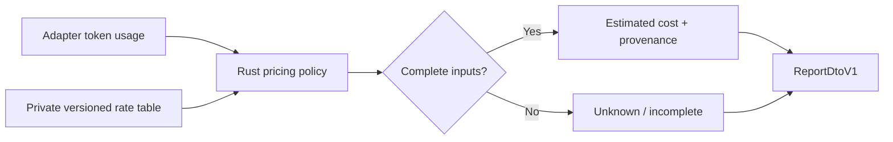

# Cost Estimation

Agent Observability의 비용 값은 local rate table과 수집된 token usage로 계산한 **예상치**다. Provider
invoice, subscription usage나 실제 청구액을 대체하지 않는다.

## Inputs

계산 가능한 dimension은 다음과 같다.

- input tokens
- output tokens
- cached input tokens
- cache creation input tokens
- reasoning output tokens

Adapter가 제공하지 않은 token dimension은 추측하지 않는다. Model을 알 수 없거나 rate table에
해당 model이 없으면 비용 상태를 `unknown` 또는 `incomplete`로 유지한다.

## Rate Table

Rate table은 `agent_observability.rate_table.v1` contract를 따르는 private JSON file이다.

```json
{
  "schema_version": "agent_observability.rate_table.v1",
  "version": "local-rates-2026-07",
  "currency": "USD",
  "unit": "per_1m_tokens",
  "assumption": "Local static rates; not a billing statement.",
  "models": {
    "example-model": {
      "input_tokens": 2,
      "output_tokens": 8,
      "cached_input_tokens": 0.5,
      "cache_creation_input_tokens": 2.5,
      "reasoning_output_tokens": 10,
      "token_semantics": {
        "cached_input_tokens": "included_in_total",
        "cache_creation_input_tokens": "included_in_total",
        "reasoning_output_tokens": "included_in_total"
      }
    }
  }
}
```

파일은 최대 1 MiB의 private regular file이어야 하며 symlink, broad permission, unknown field,
unsupported unit과 음수·비정상 rate를 거부한다.

## Calculation

각 dimension은 다음 식으로 계산한다.

```text
dimension_cost = billable_tokens * rate_per_1m / 1,000,000
estimated_cost = sum(dimension_cost)
```

`token_semantics`가 cached input, cache creation input 또는 reasoning output token이 total에
포함된다고 선언하면 중복 과금을 막기 위해 해당 overlap을 먼저 분리한다. Cumulative total을 개별
요청 token처럼 다시 더하지 않는다.

Report의 top-level cost aggregate는 금액만 표시하지 않고 다음 provenance를 유지한다.

- `status`와 선택적 `estimated_cost`
- rate table이 있을 때의 `rate_table.version`
- `cost.assumption`
- rate table과 token-bearing record가 있을 때의 incomplete/unknown count

각 span의 cost detail은 해당 계산에서 누락된 dimension과 semantic error를 별도로 유지한다. Rate table
자체가 없으면 aggregate는 `unknown`과 그 사유를 반환하며 version이나 count를 만들어 내지 않는다.

## Known Limits

- 구독, bundle, credit, volume discount와 계약 단가는 자동으로 알 수 없다.
- 실패 요청, retry와 cache 과금 정책은 provider 정책과 rate table 가정에 따라 다를 수 있다.
- Agent가 usage를 누락하면 문자 수나 transcript 크기로 token을 임의 추정하지 않는다.
- Model alias가 실제 billing model과 같다는 증거가 없으면 자동 매핑하지 않는다.
- Rate table은 사용자가 version을 고정하고 검토해야 하며 project가 외부 pricing source를 호출하지 않는다.

## Report Flow



TypeScript UI는 `ReportDtoV1`의 결과를 표시할 뿐 browser에서 rate table을 읽거나 비용을 다시 계산하지
않는다. Model/rate compatibility의 architecture rule은
[ARCHITECTURE.md](ARCHITECTURE.md#model-and-pricing-compatibility)를 따른다.
