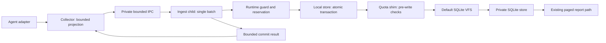

# 수집 작업 격리와 저장 예산 강제 설계

상태: **v1.11 개발 설계 — 범위 확장 승인, 구현·의존성 채택·실제 설치 미완료.**

최신 판단: 아래 의존성 사전 검토에서 현재 정책에 맞는 safe pass-through shim을 찾지
못했다. 따라서 **선택한 shim 경로의 P0 사전 검토는 NO-GO**이며 P1을 시작하지 않는다.
실행 실험으로 실패를 재현했다는 뜻은 아니다. 모든 가능한 Rust 해결책이 불가능하다는
결론도 아니다. 구조적 fast path나 저장 구조 대안 비교가 다음 설계 작업이다.

이 문서는 [Staged Ingest](STAGED_INGEST.md)의 후속 설계다. 목표는 기존 데이터를 지우거나
1 GiB 설정을 올리지 않고도 안전하게 수집을 계속하는 것이다. 프로세스를 나누는 것만으로
디스크·메모리 한도가 생긴다고 주장하지 않는다. 아래 P0에서 제한을 실제로 강제하는 경계를
증명하지 못하면 작은 예약량을 사용하는 경로는 활성화하지 않는다.

## 왜 저장 계층까지 바꾸는가

현재 collector는 입력 처리와 SQLite 쓰기를 같은 프로세스에서 수행한다.
`crates/local-collector/src/lib.rs`의 `admit_request` / `commit_batch` 경로와
`crates/local-store/src/lib.rs`의 ordered transaction이 통합 지점이다.
입력 한 건이 `lifecycle.rs::prepare_archived_trace`의 여러 행 복원이나 topology의 최대
4,096개 자식 처리를 유발할 수 있다. 입력 크기만으로 실제 쓰기량을 예약할 수 없다.

| 방법 | 얻는 것 | 해결하지 못하는 것 |
| --- | --- | --- |
| 현재 전체 store 기준 예약 | 보수적인 기존 수집 거부/허용 판단 | 데이터가 커지면 작은 수집도 거부될 수 있음 |
| 좁은 입력만 받는 구조적 계산 | 추가 라이브러리 없는 fast path 후보 | B-tree·overflow·freelist·오류 경로 전체와 메모리 상한 증명이 아직 없음 |
| 전용 자식 프로세스 | 수명·장애·SQLite 전역 설정을 다른 작업과 분리 | 단독으로 디스크 quota나 hard RSS 제한을 만들지 않음 |
| 쓰기 제한 VFS shim | SQLite 파일 쓰기 **이전**에 예약 예산 검사 가능 | 잠금·복구·모든 임시 파일·물리 할당까지 검증해야 함 |
| OS quota / 메모리 격리 | 해당 플랫폼이 지원하는 강제 제한 | 관리자 권한·플랫폼 차이; 기본 로컬 설치의 필수 조건으로 추가하지 않음 |

검증 우선안은 **전용 자식 프로세스 + 기본 SQLite VFS에 위임하는 제한 shim**이다.
이는 설계 후보 선택이지 적합한 라이브러리를 찾았다는 뜻이 아니다. SQLite를 교체하거나
새 storage schema를 도입하는 결정도 아니다. 프로젝트의 Rust/TypeScript 원칙과
`unsafe_code = "forbid"`는 유지한다. 외부 safe API의 내부 FFI도 검토 대상이며,
적합한 의존성이 없다고 자체 unsafe 코드나 C 제품 코드를 조용히 추가하지 않는다.

## 목표 동작 구조

전용 mode는 같은 Rust executable의 내부 명령으로 제안한다. 사용자가 별도 서버·Docker·
앱을 설치하거나 새 포트를 열 필요는 없다. 초기에는 batch마다 한 자식을 실행하고 수집
runtime당 동시에 하나만 허용한다. 재사용 worker pool은 측정 후 별도 결정한다.
수동 import는 기존 경로를 유지한다. team 기능이나 외부 전송을 추가하지 않는다.

### 책임과 권한

| 영역 | 제안 책임 | 금지 사항 |
| --- | --- | --- |
| Collector | 기존 인증, 입력 bound, adapter projection, backpressure, 재시도 | 자식 성공 전에 cursor/correlation 확정; 무제한 대기열 |
| Local IPC contract | 버전, 길이·개수·중첩 상한, batch identity, 제한된 결과 enum | 원본 hook/OTLP payload, 임의 파일 경로, SQL, 오류 문자열 전송 |
| Ingest child | 입력 검증, 잠금 획득, DB recovery, transaction 실행, 결과 반환 | 네트워크 endpoint, 독자적 삭제·예산 상향, 로그에 요청 덤프 |
| Local runtime | 전역 예산·예약·잠금·프로세스 수명 | 부모/자식이 같은 여유 공간을 중복 예약 |
| Local store | 현재 ordered batch 의미, idempotency, rollback | transaction을 여러 commit으로 쪼개 cursor만 먼저 확정 |
| 제한 shim | 쓰기 전 차감, 기본 VFS 위임, 실패 주입 | 파일 잠금·sync·hot-journal recovery를 자체 재해석 |

IPC는 상속된 익명 pipe를 우선 검증한다. stdin/stdout은 framing 전용이고 stderr는
고정 코드와 수치만 허용한다. secret, DB 내용, raw content를 argv/env/임시 handoff 파일로
전달하지 않는다. launch 시 cwd나 untrusted 경로로 실행 파일을 찾지 않고 검증한 설치
실행 파일을 사용한다. config와 root identity를 자식에서 다시 검사한다.
응답은 요청 batch identity와 연결해 검증한다. stdin/stdout frame은 길이 header를 검사한
뒤에만 메모리를 할당한다. stderr도 부모가 읽는 byte 상한을 두며, child panic/error
처리에서 raw payload를 출력하지 않는 fixture가 필요하다. 상속 환경·descriptor는 필요한
항목만 허용하고 stdin EOF/부모 종료 후 자식이 독립 daemon으로 남지 않게 검증한다.

IPC의 transient observation은 기존 allowlist projection **이후**의 데이터만 허용한다.
팀 envelope와 다른 machine-local 계약이며 그대로 팀 전송에 재사용할 수 없다.
현재 raw opt-in 처리·보관·삭제 동작과의 parity fixture가 통과해야 하며, raw 필드를 새
계약에 암묵적으로 포함하거나 반대로 조용히 누락해서는 안 된다. 필요한 필드와 한계는
`contracts/`에 versioned schema로 정의한 뒤 Rust 검증에서 사용한다.

## 원자성·장애 복구 프로토콜

1. 부모가 기존 크기 제한 내에서 batch를 만들고 private pipe로 보낸다. 큐는 기존 상한을
   유지하며 포화 시 역압력을 준다. 입력을 버리고 성공으로 응답하지 않는다.
2. 자식은 SQLite open/recovery **전**에 해당 runtime의 mutation guard를 획득한다.
   부모는 같은 guard를 잡고 기다리지 않는다. 파일 descriptor 상속만으로 소유권을 넘기지 않는다.
   동일 guard 아래에서 root·config·기존 예약과 파일 상태를 검사하고 recovery 예산과 제한
   경계를 먼저 준비한다. hot-journal recovery를 무예약·무제한 open으로 시작하지 않는다.
3. guarded open/recovery 뒤 schema/mode를 검증하고 ingest 예약을 취득한다. 모든 다른
   writer/report builder와 동일 전역 예산을 사용한다. 기존 report reservation 파일 형식을
   임의로 재사용하지 않고 ingest lifecycle을 별도로 검증한다. open 전 recovery 예약에서
   transaction 예약으로의 전환은 중복 대여나 예약 공백 없이 검증한다.
4. BEGIN IMMEDIATE 안에서 geometry와 transaction quota ledger 전환을 재검증한 뒤 ordered writes를
   실행한다. 관측값·disposition·delivery outcome·cursor·correlation·generation은 기존처럼
   함께 commit 또는 rollback한다. precommit 검사는 추가 방어선으로 남긴다.
5. 정상 commit과 필요한 durability 확인 뒤에만 부모로 성공 결과를 보낸다. 부모는 검증된
   결과로 in-memory cursor/correlation을 갱신하고 기존 report invalidation을 처리한다.
6. pipe 단절·timeout·자식 종료는 **commit 여부 불명**으로 처리한다. 부모는 성공/실패를
   추정해서 cursor를 바꾸지 않는다. 다음 guarded open에서 hot-journal recovery를 수행하고
   기존 durable identity/cursor/correlation으로 재동기화한 뒤 같은 batch를 idempotent 재시도한다.

크래시 후에는 자식이 종료됐다는 사실만으로 예약을 돌려주지 않는다. 기존 안정된 잠금
identity를 보존하고, guarded recovery 및 산출물 재계산이 끝날 때까지 interrupted 예약을
계속 차감한다. 초기 목표는 새 durable receipt table 없이 기존 transaction authority로
응답 유실을 복구하는 것이다. 기존 상태로 결과를 구분할 수 없는 사례가 나오면 schema
변경으로 우회하지 않고 해당 구현 단계를 중단한다.

## 디스크 제한 계약

VFS는 `xWrite`뿐 아니라 `xTruncate`, open/delete, journal·statement subjournal·temp file,
추가 attachment 및 mmap/write 우회 경로까지 열거하고 검사해야 한다. SQL 길이나
최종 journal 크기를 quota로 취급하지 않는다. 알려지지 않은 파일 종류·mode는 거부한다.
첫 경로는 검증된 DELETE journal, 단일 DB, 기존 schema/mode에 한정한다.

검사 순서는 **예산 계산 → 쓰기 승인 → 기본 VFS 호출**이다. 여러 파일의 누적 사용량,
파일 offset overflow, sector framing, 반복 쓰기, sparse 구간 materialization을 포함한다.
논리 EOF 제한만 통과한 것을 실제 `allocated_tree_bytes` 제한 통과라고 부르지 않는다.
실제 파일 시스템의 할당 단위·지원 특성을 검증해 allocation envelope를 증명해야 한다.
외부 APFS snapshot/clone의 COW 비용이나 다른 앱의 디스크 사용까지 통제한다는 보장은 하지 않는다.
지원 환경에서의 앱 소유 할당량과 시스템 여유 공간 실패를 분리해 기록한다.

가장 중요한 실패 사례는 **한도에 걸린 뒤 rollback에도 쓰기 공간이 필요한 경우**다.
새 쓰기를 위한 예산과 recovery에 남겨 둘 예산을 구분하며, recovery는 무제한 quota
bypass가 아니다. 한도를 소진한 상태의 중간 종료·재시작까지 원래 authority가 복구되고,
예약이 조기 해제되지 않는다는 증거 없이는 활성화하지 않는다. OS ENOSPC/EIO와 quota
거부도 분리하되 외부 진단은 기존 privacy-safe enum 원칙을 따른다.

한 batch가 설정된 실행 예산을 넘는 경우 같은 입력을 즉시 무한 재시도하지 않는다.
rollback/recovery를 확인한 뒤 기존 보수 경로의 전체 예약이 확보될 때만 fallback할 수 있다.
그렇지 않으면 source cursor를 유지하고 capacity 상태를 노출한다. 부분 성공이나 데이터
삭제로 통과시키지 않는다. 일시 contention과 반복해도 해결되지 않는 batch 한도를 구분한다.

## 메모리·CPU 계약

- 전용 프로세스의 SQLite heap 제한은 첫 connection 이전 한 번만 설정·확인하는 후보다.
  shared collector 안에서 transaction마다 전역 한도를 바꾸지 않는다. 적용 API·빌드 옵션의
  실제 enforcement와 실패 시 rollback/reopen을 P0에서 확인한다.
- Rust input/result/queue, decode depth/count, correlation 및 복원 경로의 임시 메모리에도
  명시적인 bounds가 필요하다. 자식 분리가 Rust heap을 자동 제한하지 않는다.
- RSS p95 ≤ 96 MiB라는 기존 성능 기준을 자식 분리로 우회하지 않는다. 새 측정은 동일
  시간축의 collector+ingest descendants 합계를 포함한다. 각 process percentile을 더하는
  대신 합산 시계열에서 percentile을 계산한다. peak와 자식 잔존도 별도 기록한다.
- hard RSS는 SQLite heap이나 virtual address-space 한도와 다른 계약이다. 지원 플랫폼에서
  강제 수단이 확인되지 않으면 hard RSS 지원을 주장하지 않는다. 이전 staged-ingest의 hard
  peak gate를 이 문서로 통과/면제하지 않는다. P0에서 지원 matrix와 계약 차이를 명시한다.
- polling 기반 kill은 이미 발생한 peak를 되돌리지 못한다. 보조 watchdog으로만 사용하며,
  bounded shutdown/reap·재시도 backoff·최대 동시 자식 1개·CPU/시간 예산을 함께 검증한다.
  플랫폼별 deadline 값은 기존 collection/hook timeout과의 호환 실험 후 정한다.

## 구현 순서와 통과 조건

| 단계 | 변경 위치 / 산출물 | 통과 조건 |
| --- | --- | --- |
| P0: 제한 수단 검증 | 격리된 Rust 실험, 의존성 검토 기록 | macOS/Linux에서 기본 VFS 위임 가능성, 디스크·메모리 제한 대상과 한계, quota 거부 후 recovery 확인; 기존 unsafe 금지 유지 |
| P1: private IPC와 수명 | `contracts/`, `crates/cli`, `crates/local-collector` | malformed/oversized/truncated frame, spoofed result, timeout, parent/child death, version mismatch에서 무진행·자식 정리; raw privacy parity |
| P2: 저장 통합 | `crates/local-runtime`, `crates/local-store` | 단일 guard와 durable reservation, write-before-charge 금지, quota/NOMEM/ENOSPC/kill rollback 및 commit 후 응답 유실 재시도 검증 |
| P3: 수집 연결 | `crates/local-collector`, status 계약 | 동일 입력의 기존 경로 parity, 중복/replay·cursor/correlation 재동기화, busy/capacity backoff; manual import는 기존 보수 경로 |
| P4: 실제 규모 수용성 | `rotation_diagnostic.rs`, `xtask`, 성능 프로토콜 | private coherent copy에서 current+retired view 유지하며 3회 ingest→publish, unchanged budget, authority/parity 및 프로세스 합산 성능 통과 |
| P5: 배포 | review checkpoint, PR41 | 최종 코드 독립 리뷰·정확한 revision CI/장시간 검사·로컬 복구/Chrome QA 후 merge/release/branch cleanup |

P0는 제품 연결을 하지 않는 실행 가능한 feasibility spike다. 적합한 safe shim API나
할당/복구 상한이 확인되지 않으면 **결과와 실패 지점을 기록하고 P1로 넘어가지 않는다**.
반복적인 관측용 코드만 추가하지 않는다. 그때 구조적 fast path 또는 별도 schema/storage
설계를 비교하며, Rust/unsafe 정책 예외·자동 OS quota 설정을 기정사실화하지 않는다.

## 근거와 확인 범위

- [SQLite VFS](https://www.sqlite.org/vfs.html): 파일 I/O 경계와 shim 구조.
- [Journal size limit](https://www.sqlite.org/pragma.html#pragma_journal_size_limit): transaction 이후
  journal 크기 조절이며 active write quota가 아니다.
- [Hard heap limit](https://sqlite.org/c3ref/hard_heap_limit64.html): SQLite heap 전체에 적용;
  connection별 또는 process RSS 한도가 아니다.
- [Progress handler](https://www.sqlite.org/c3ref/progress_handler.html): 주기적 중단 callback이지
  각 파일 쓰기의 사전 승인 경계가 아니다.

라이브러리/OS 검토 결과는 아래에 검증한 버전과 upstream 근거를 붙인다. 이 설계에는 아직
새 dependency나 Cargo feature를 추가하지 않았으며, 설치된 v1.10 runtime을 변경하지 않았다.

### OS 제한 수단 검토 — 2026-09-08

| 환경 | 확인한 수단 | 설계에 사용할 수 있는 주장 |
| --- | --- | --- |
| Linux | `RLIMIT_AS` | virtual address space 제한. RSS라고 표시하지 않음 |
| macOS | 공개된 Apple BSD `setrlimit` 문서의 DATA/RSS 의미 | DATA는 data segment, RSS는 메모리 압박 시 회수 우선순위. 일반 앱의 strict process-memory 상한은 이번 조사에서 확인되지 않음 |
| Linux cgroup v2 | `memory.max`와 delegation | 배포자가 권한을 제공한 선택적 containment 후보. 자동 생성·관리자 권한 요구 없음; OOM 종료와 일시 초과 고려 |
| Windows | Job Object process/job memory | committed memory 제한 참고. 이번 macOS/Linux 구현 범위에 Windows 지원을 추가하지 않음 |

근거: [Linux getrlimit](https://man7.org/linux/man-pages/man2/getrlimit.2.html),
[Apple BSD setrlimit](https://developer.apple.com/library/archive/documentation/System/Conceptual/ManPages_iPhoneOS/man2/setrlimit.2.html),
[Linux cgroup v2](https://docs.kernel.org/admin-guide/cgroup-v2.html),
[Windows Job limits](https://learn.microsoft.com/en-us/windows/win32/api/winnt/ns-winnt-jobobject_basic_limit_information).
Apple 문서는 archive이므로 현재 대상 macOS의 더 강한 보장을 추정하지 않는다.
특히 macOS가 주 사용 환경이므로 Linux만 통과한 증거로 P0 전체를 통과 처리하지 않는다.

`RLIMIT_FSIZE`는 파일 **각각**의 길이 제한이지 DB+journal+temp의 합계 예약이 아니다.
따라서 VFS/전역 예산 검사를 대신하지 않는다. Rust `CommandExt::pre_exec`도 unsafe API이므로
워크스페이스 정책을 깨는 방식으로 제한을 주입하지 않는다.
[Rust 공식 문서](https://doc.rust-lang.org/std/os/unix/process/trait.CommandExt.html)를 따라
한도 설정은 자식 executable 시작 후 첫 DB open/입력 decode 이전의 safe API 후보로 검토하되,
그 이전 loader/startup 메모리가 제한된다고 주장하지 않는다.

### 의존성 사전 검토 — 2026-09-08

| 후보 | upstream 근거 | 이번 판단 |
| --- | --- | --- |
| `sqlite-plugin` 0.11.0, MIT/Apache-2.0 | [VFS trait](https://github.com/orbitinghail/sqlite-plugin/blob/v0.11.0/src/vfs.rs), [package](https://docs.rs/crate/sqlite-plugin/0.11.0) | safe default-file pass-through 대신 사용자에게 file I/O·locking·sync 구현을 요구. 이번 경계에 부적합; 채택 안 함 |
| `sqlite-vfs` 0.2.0, MIT/Apache-2.0 | [API](https://docs.rs/sqlite-vfs/0.2.0/sqlite_vfs/), [upstream status](https://github.com/rkusa/sqlite-vfs#status) | DatabaseHandle의 I/O·locking 등 구현이 필요하고 upstream도 production-ready로 보장하지 않음. 채택 안 함 |
| SQLite native shim 직접 작성 | [VFS shim](https://www.sqlite.org/vfs.html), [quota example source](https://sqlite.org/src/doc/trunk/src/test_quota.c) | 기본 VFS 위임 구조의 참고 자료. 자체 native/FFI 구현은 현재 Rust/unsafe 정책의 예외가 필요하므로 선택하지 않음 |

검토 대상은 `rusqlite 0.40.2` / `libsqlite3-sys 0.38.2` / bundled SQLite 3.53.2다.
후보의 이 조합에 대한 linking·실행 호환성은 검증되지 않았다. native shim 예제 역시
논리 길이 제한을 물리 할당량 제한으로 승격할 수 없고, 현재 upstream quota 예제의
open 분류를 모든 journal/temp가 포괄된다고 가정해서는 안 된다. 이번에는 다운로드·설치·
Cargo 수정·C/C++ 추가·unsafe lint 완화를 하지 않았다.

독립 아키텍처 리뷰의 P0-only CLEAR는 **이런 부정적 결과를 낼 수 있는 조사 절차**에 대한
승인이다. 의존성 채택이나 P0 통과가 아니다. 자식 분리가 unsafe를 없애 준다는 이유로
정책을 우회하지 않는다. 다음 대안 설계에서는 현재 schema의 좁은 쓰기 경로에 대한
구조적 상한과, 작은 저장 단위로 분리하는 schema 변경 비용을 비교한다. 후자는 현재
schema 불변 계약을 바꾸므로 migration/rollback/privacy 영향부터 명시하며 자동 적용하지 않는다.
