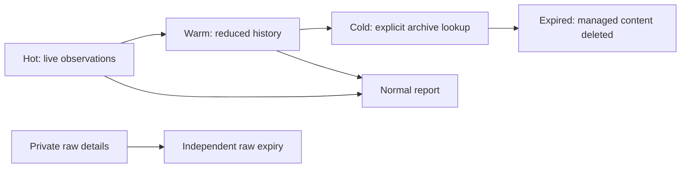

# Local storage lifecycle

Status: **v1.11.0 implementation in progress; not available in the published v1.10.0.**

## Goal

Keep recent observations fast to inspect while bounding local disk use. Hot, warm and cold are
local data lifecycle stages, not Elasticsearch services or a requirement for a remote backend.

| Stage | Intended storage and access | Age since latest trace observation |
| --- | --- | --- |
| Hot | Live observation state and normal report | Less than `hot_days` |
| Warm | Privacy-safe projected records; original observation history removed | At least `hot_days`, less than `warm_days` |
| Cold | Local archive excluded from the normal report; explicit retrieval | At least `warm_days`, less than `delete_after_days` |
| Expired | Managed trace content permanently removed | At least `delete_after_days` |

Thresholds are cumulative ages, not durations added together. Proposed defaults are 7, 30 and
90 days. Physical representation and query evidence must be verified before this feature is
marked complete. Merely labeling unchanged live rows as cold does not meet the performance goal.
Compression is not claimed unless the implemented format and measurements prove it.



The diagram shows the normal age progression; a sufficiently old Hot trace may move directly to
Cold or expire in one pass. Retained warm/cold traces need private reducer control state so later
input can restore them before reduction. That internal state is not an export or report surface.

Expired context cannot resume transparently. While its count-bounded purge tombstone remains,
new or changed observations for that trace are terminally suppressed with `expired_trace`; exact
expired-span replays keep the existing `duplicate_observation` classification. The input cursor
advances and unrelated batch items continue, but expired records and reducer state are not restored.
Start a new upstream session/trace to collect new work after this boundary. This is a limitation of
destructive expiry, not a claim that every old session resumes. Tombstones are bounded by count,
not a guaranteed number of days. `storage-check` and authenticated collector health expose
`expired_trace_dispositions` (retained diagnostic count, not a lifetime total); collector health
is degraded while such retained suppressions exist. Reusing a cursor with different data is still
a hard conflict. Synthetic trace epochs and parent rewriting are not part of v1.11.

## Development commands

These commands belong to the unpublished v1.11.0 branch. Use a disposable runtime for evaluation;
automatic deletion stays off unless explicitly enabled in settings.

```bash
agentobs settings /path/to/runtime
agentobs lifecycle-run /path/to/runtime
agentobs cold-read /path/to/runtime
```

`lifecycle-run` executes one pass and reports disabled, busy, idle, blocked, or completed. A blocked
pass may have moved other eligible traces; the automatic collector reports degraded health until
a later pass succeeds without blocked work or lifecycle is disabled. A completed bounded pass is
not proof that every expired trace was deleted. `cold-read`
prints a bounded page of sanitized archive records with a cursor; pass the returned cursor as the
second argument for the next page. Oversized archives report a blocked entry rather than loading
the full blob. Neither command installs a background service.

`blocked` counts unresolved traces or traces individually larger than the pass limits. `deferred`
counts traces that fit those limits but must wait because earlier work consumed this pass's budget;
ordinary deferral does not degrade collector health. Maintenance health describes the last pass,
not a full scan of every retained trace.

The versioned collector health (`local_collector_health.v1`) and settings integration status
(`codex_integration_status.v1`) carry allowlisted reasons to the existing settings status panel:

| Reason | Meaning |
| --- | --- |
| `lifecycle_failure` | The last maintenance pass failed or encountered individually blocked traces |
| `storage_pressure` | The last pass lacked the configured temporary storage headroom required for maintenance |
| `expired_trace` | Retained diagnostics show later input excluded from a fully expired trace; start a new agent session |

An older collector or an unrecognized reason retains the generic degraded message. The UI does not
infer a cause from counters or the coarse status. Other report/collector degradation can still be
generic; these reasons do not claim to classify every operating-system or I/O error.

Before destructive maintenance, the managed HTML report is atomically replaced by a data-free
refresh notice under the report publication lock. The collector rebuilds it from committed storage;
after a manual one-shot or `retention-apply`, run `agentobs report /path/to/runtime`. A browser tab
that already loaded the old report or a separately copied report cannot be remotely erased.

## Safety and compatibility

- Existing installations migrate with automatic lifecycle **disabled**. Saving a retention value
  alone must not silently enable automatic deletion.
- The settings screen must explain that enabling lifecycle applies to existing eligible data.
  Reducing a threshold can make previously retained data immediately eligible on the next pass.
- Raw Codex details remain local-only, outside normal reports, sanitized archives and team
  transport. They have an independent retention duration when lifecycle is enabled.
- User-created manual archives outside the managed runtime are never deleted by this policy.
- Eligibility is whole-trace and based on the newest observation. Recent activity and unresolved
  topology prevent partial trace removal. Cursor and replay protections survive expiry within
  the documented bounded replay horizon.
- A lower storage budget does not authorize early deletion of unexpired data. Existing admission
  limits remain fail-closed; cleanup can reclaim eligible data and blocked cleanup must be visible.
- Expiry means removal from managed live/tier storage, not secure erasure of SSD blocks, backups,
  browser downloads or separately exported files.

## Execution and performance acceptance

Automatic maintenance runs only while the optional local collector is running. A standalone
one-shot command must provide the same bounded pass without requiring a daemon. A stopped machine
cannot delete at an exact wall-clock deadline; eligible work resumes on the next maintenance pass.

The worker must use bounded trace/record/byte work, a configurable cadence, nonblocking lock
admission, and a separate blocking executor. It must not scan entire transcripts, render reports
inside the write transaction, perform full-database vacuum, or queue overlapping passes. Oversized
or pinned traces must not cause an unbounded loop. Atomic transitions and restart-safe retries are
required. Disk admission must account for temporary rollback-journal growth, not only the final
compacted size; the current SQLite store uses DELETE journaling, not WAL.

Legacy indexing has an independent bounded 2 MiB pass allowance, so a smaller archive setting does
not strand larger existing rows. A legacy row beyond that indexing bound pins its trace with a
persistent blocked marker while later traces can progress. It is not silently declared indexed or
deleted, and increasing the archive setting alone does not clear that marker. Such oversized rows
are possible through the lower-level store API, not the current official adapter projections.

## Completion gates

- Versioned configuration migration and Rust/TypeScript validation parity.
- Actual tier movement, explicit cold access, expiry, and bounded replay tests.
- Disabled/default behavior, threshold boundary, late/duplicate input, crash/retry, busy lock,
  oversized trace, storage pressure and source-format parity fixtures.
- Independent review of data-loss, privacy, concurrency and performance risks.
- Settings browser QA and fresh measured maintenance/ingest performance evidence.
- README, ROADMAP, configuration, local runtime, architecture and DESIGN agree with tested behavior.

Until these gates pass, the release remains in progress and no production cleanup is enabled by
development or QA commands.
